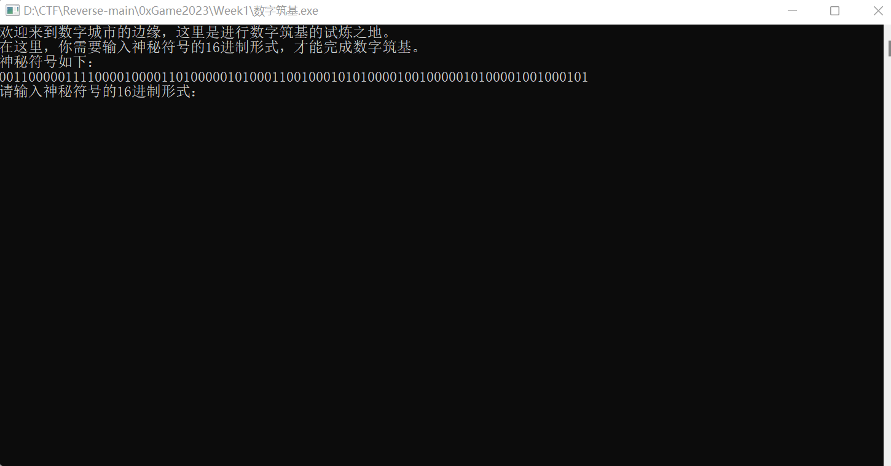
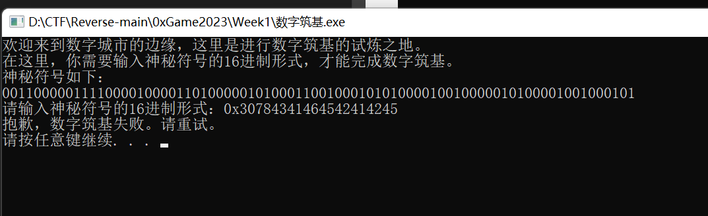
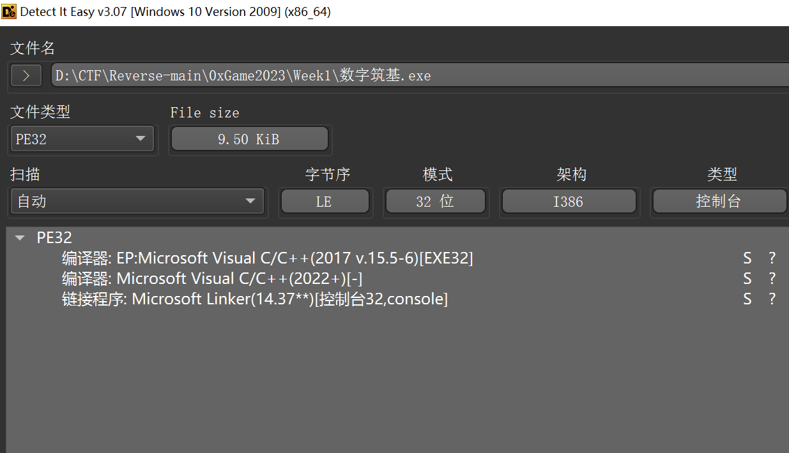
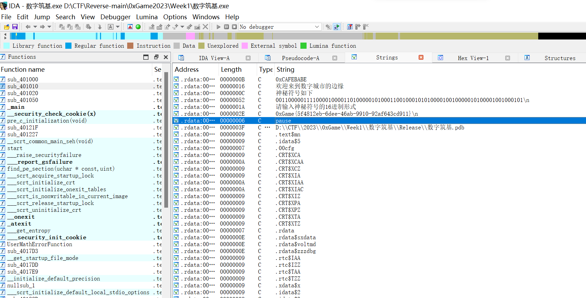

**exe先运行一下，传入十六进制，发现没用**

```python
binary_str = "00110000011110000100001101000001010001100100010101000010010000010100001001000101"
# 将二进制字符串转换为整数
int_value = int(binary_str, 2)
# 将整数转换为十六进制字符串
hex_str = hex(int_value)
print(hex_str)

# 0x30784341464542414245
```

**没用，就查一下壳： 没壳， 32位**


**用IDA32打开**

**额，然后shift+F12查看字符串，flag就出来了**
