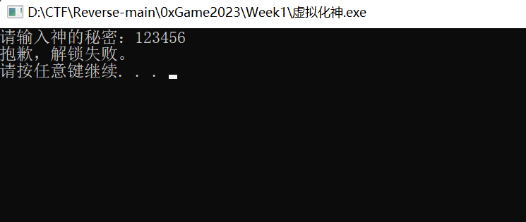
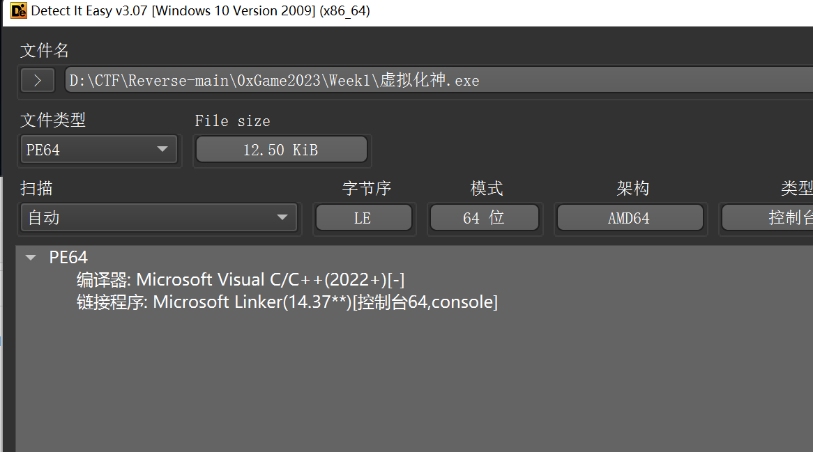
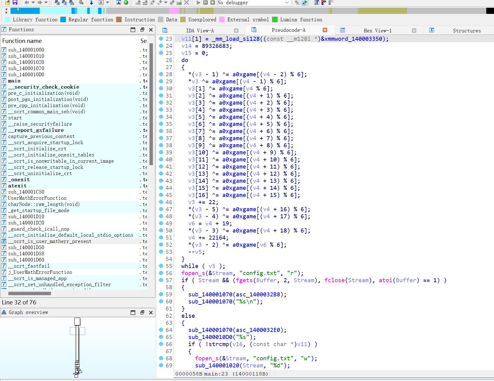
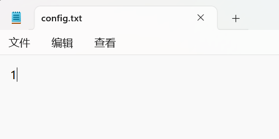
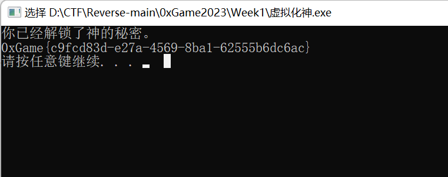

```if ( Stream && (fgets(Buffer, 2, Stream), fclose(Stream), atoi(Buffer) == 1) )```：这是一个条件语句，它检查几个条件：

- Stream 是否不为 NULL，即文件是否成功打开。
- fgets(Buffer, 2, Stream)：从文件中读取最多1个字符（因为第二个参数是2，包括空字符）到 Buffer 中。注意，这里的2可能应该是一个更大的值，以确保能够读取完整的行。
- fclose(Stream)：关闭文件。这个函数调用在逗号表达式中，意味着它会在 fgets 之后执行，但 Stream 的值在关闭文件后仍然是有效的，因为它是一个宏，实际上不会改变 Stream 的值。
- atoi(Buffer) == 1：将 Buffer 中的字符串转换为整数，并检查是否等于1。

这段代码的逻辑是，如果文件成功打开，读取文件的第一行（或前两个字符），关闭文件，然后检查读取的内容是否表示整数1。如果所有这些条件都满足，那么 if 语句中的代码将被执行。

改0为1,再次运行

