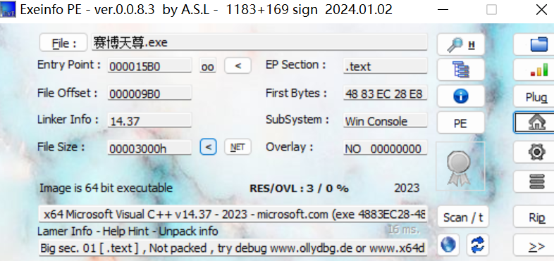
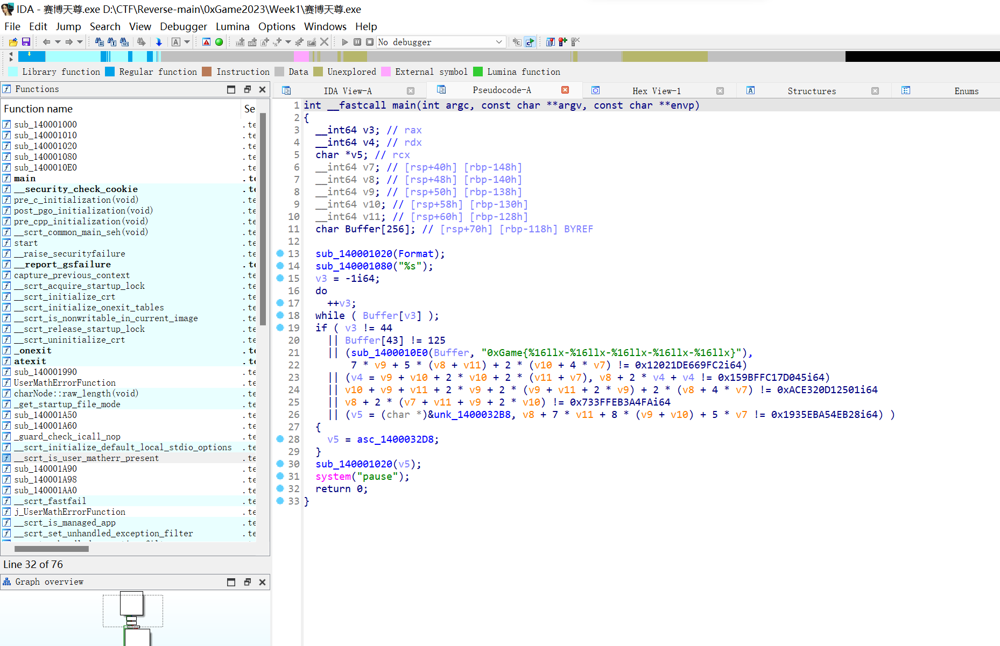

```c
int __fastcall main(int argc, const char **argv, const char **envp)
{
  __int64 v3; // rax
  __int64 v4; // rdx
  char *v5; // rcx
  __int64 v7; // [rsp+40h] [rbp-148h]
  __int64 v8; // [rsp+48h] [rbp-140h]
  __int64 v9; // [rsp+50h] [rbp-138h]
  __int64 v10; // [rsp+58h] [rbp-130h]
  __int64 v11; // [rsp+60h] [rbp-128h]
  char Buffer[256]; // [rsp+70h] [rbp-118h] BYREF

  sub_140001020(Format);
  sub_140001080("%s");
  v3 = -1i64;
  do
    ++v3;
  while ( Buffer[v3] );
  if ( v3 != 44
    || Buffer[43] != 125
    || (sub_1400010E0(Buffer, "0xGame{%16llx-%16llx-%16llx-%16llx-%16llx}"),
        7 * v9 + 5 * (v8 + v11) + 2 * (v10 + 4 * v7) != 0x12021DE669FC2i64)
    || (v4 = v9 + v10 + 2 * v10 + 2 * (v11 + v7), v8 + 2 * v4 + v4 != 0x159BFFC17D045i64)
    || v10 + v9 + v11 + 2 * v9 + 2 * (v9 + v11 + 2 * v9) + 2 * (v8 + 4 * v7) != 0xACE320D12501i64
    || v8 + 2 * (v7 + v11 + v9 + 2 * v10) != 0x733FFEB3A4FAi64
    || (v5 = (char *)&unk_1400032B8, v8 + 7 * v11 + 8 * (v9 + v10) + 5 * v7 != 0x1935EBA54EB28i64) )
  {
    v5 = asc_1400032D8;
  }
  sub_140001020(v5);
  system("pause");
  return 0;
}
```

```python
from z3 import *

# 创建变量
# x = [0] * 6
# 方法一
# for i in range(7, 12):
#     x[i] = z3.Real('x[' + str(i) + ']')

# 方法二
v7, v8, v9, v10, v11 = Ints("v7 v8 v9 v10 v11")

solver = Solver()

# 添加约束条件

solver.add(7 * v9 + 5 * (v8 + v11) + 2 * (v10 + 4 * v7) == 0x12021DE669FC2)
v4 = v9 + v10 + 2 * v10 + 2 * (v11 + v7)
equations = [
    v8 + 2 * v4 + v4 == 0x159BFFC17D045,
    v10 + v9 + v11 + 2 * v9 + 2 * (v9 + v11 + 2 * v9) + 2 * (v8 + 4 * v7) == 0xACE320D12501,
    v8 + 2 * (v7 + v11 + v9 + 2 * v10) == 0x733FFEB3A4FA,
    v8 + 7 * v11 + 8 * (v9 + v10) + 5 * v7 == 0x1935EBA54EB28
]

for q in equations:
    solver.add(q)

# 判断是否有解
if solver.check() == sat:
    result = solver.model()
    print(result)
else:
    raise Exception("NO SOLUTION!")

# [v11 = 63356652901730,
#  v7 = 2693650760,
#  v10 = 41791,
#  v9 = 16488,
#  v8 = 14810]
```

```python
v11 = 63356652901730
v9 = 16488
v7 = 2693650760
v8 = 14810
v10 = 41791

print("0xgame{", '-'.join([hex(i)[2:] for i in [v7, v8, v9, v10, v11]]), "}")
# 0xGame{a08dd948-39da-4068-a33f-399f5eca5562}
```