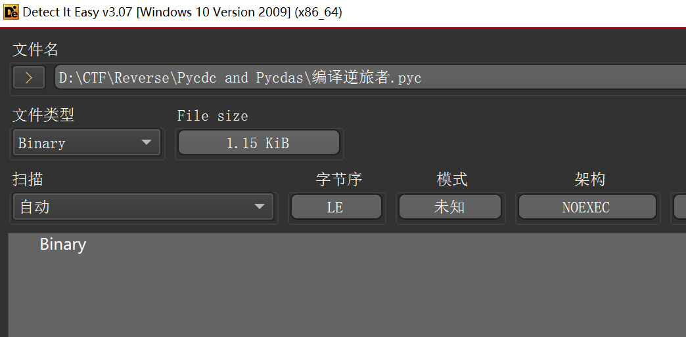
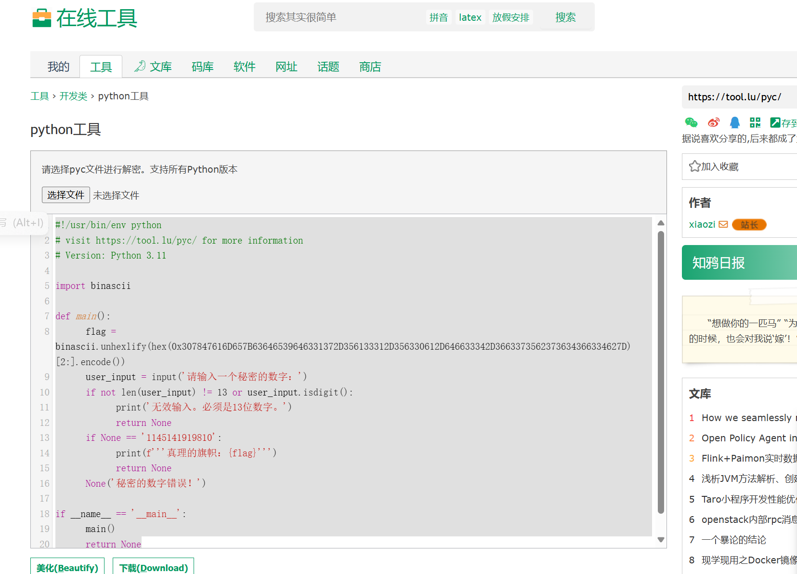

```python
#!/usr/bin/env python
# visit https://tool.lu/pyc/ for more information
# Version: Python 3.11

import binascii

def main():
    flag = binascii.unhexlify(hex(0x307847616D657B63646539646331372D356133312D356330612D646633342D3663373562373634366334627D)[2:].encode())
    user_input = input('请输入一个秘密的数字：')
    if not len(user_input) != 13 or user_input.isdigit():
        print('无效输入。必须是13位数字。')
        return None
    if None == '1145141919810':
        print(f'''真理的旗帜：{flag}''')
        return None
    None('秘密的数字错误！')

if __name__ == '__main__':
    main()
    return None
```

```python
import binascii

flag = binascii.unhexlify(
        hex(0x307847616D657B63646539646331372D356133312D356330612D646633342D3663373562373634366334627D)[2:].encode())

print(flag)
# b'0xGame{cde9dc17-5a31-5c0a-df34-6c75b7646c4b}'
```
**python encode()**
---
在 Python 中，`encode()` 方法用于将字符串对象转换为字节对象。这个方法对于处理文本数据和二进制数据之间的转换非常有用，尤其是在网络传输或文件操作中。

### 基本用法

`encode()` 方法的基本语法如下：

```python
str.encode(encoding='utf-8', errors='strict')
```

- **encoding**：指定编码方式，默认为 `'utf-8'`。常见的编码方式还包括 `'ascii'`、`'latin-1'`、`'utf-16'` 等。
- **errors**：指定如何处理编码错误。常见的选项包括：
  - `'strict'`：默认值，遇到编码错误时抛出 `UnicodeEncodeError`。
  - `'ignore'`：忽略错误，不将无法编码的字符包含在结果中。
  - `'replace'`：用一个特殊的替换字符（通常是 `'?'`）来替换无法编码的字符。

### 示例

```python
# 使用默认的 utf-8 编码
text = "Hello, World!"
encoded_text = text.encode()
print(encoded_text)  # 输出: b'Hello, World!'

# 使用 ascii 编码
encoded_text = text.encode('ascii')
print(encoded_text)  # 输出: b'Hello, World!'

# 使用 utf-16 编码
encoded_text = text.encode('utf-16')
print(encoded_text)  # 输出: b'\xff\xfeH\x00e\x00l\x00l\x00o\x00,\x00 \x00W\x00o\x00r\x00l\x00d\x00!\x00'

# 处理编码错误
text = "Hello, Sérgio!"
try:
    encoded_text = text.encode('ascii')
except UnicodeEncodeError as e:
    print(e)  # 输出错误信息

# 使用 replace 选项处理编码错误
encoded_text = text.encode('ascii', errors='replace')
print(encoded_text)  # 输出: b'Hello, S?rcio!'
```

### 注意事项

- `encode()` 方法只能用于字符串对象。
- 编码后的字节对象不能再使用 `decode()` 方法转换回原始字符串，除非完全知道原始编码和错误处理方式。
- 在处理非 UTF-8 编码的文本时，确保了解目标编码的特性，以避免数据丢失或损坏。

`encode()` 方法是 Python 处理文本和二进制数据转换的基础工具之一，正确使用它可以帮助你在不同的编程场景中有效地处理数据。
