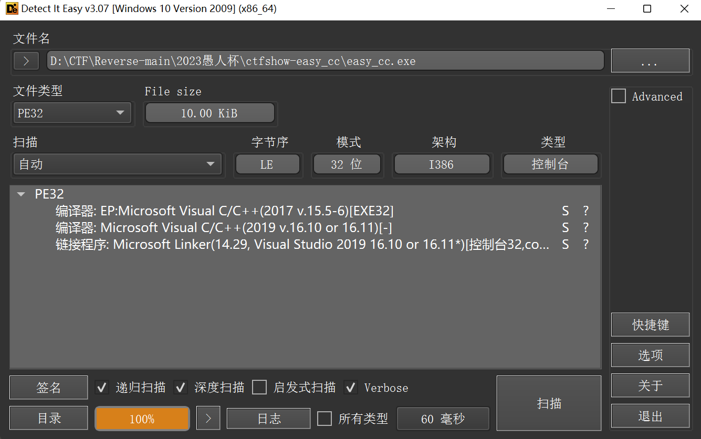
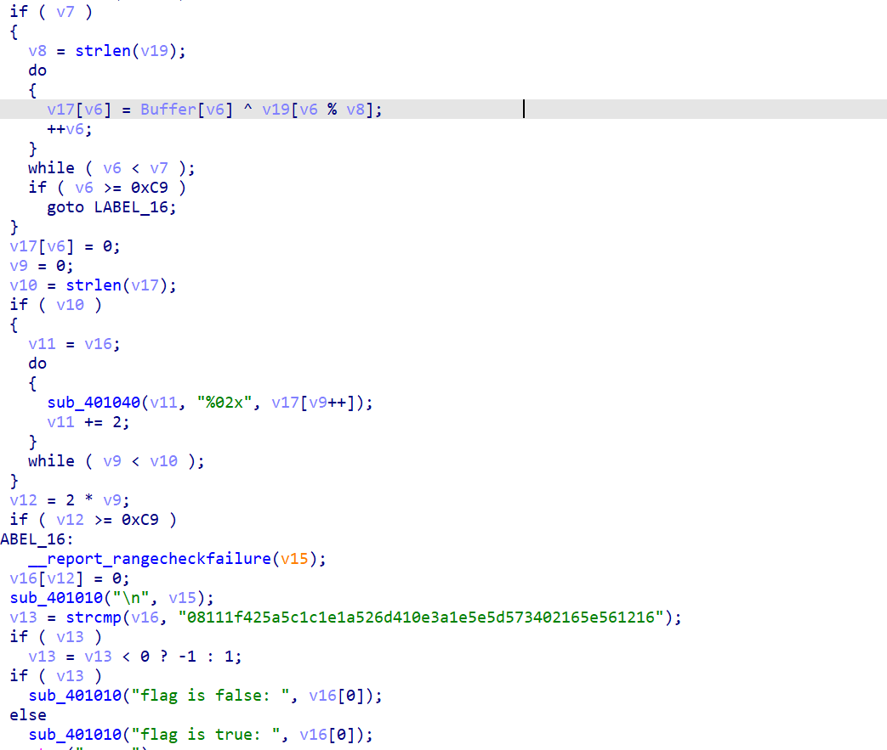

```python
c = [0x08, 0x11, 0x1f, 0x42, 0x5a, 0x5c, 0x1c, 0x1e, 0x1a, 0x52, 0x6d, 0x41, 0x0e, 0x3a, 0x1e, 0x5e, 0x5d, 0x57, 0x34,
     0x02, 0x16, 0x5e, 0x56, 0x12, 0x16]
key = "key123"
flag = ""
for i in range(len(c)):
    c[i] ^= ord(key[i % len(key)])
    flag += chr(c[i])
print(flag)

# ctfshow{cc_re_good_good!}
```


```python
x = '08111f425a5c1c1e1a526d410e3a1e5e5d573402165e561216'
key = 'key123'
for i in range(0, len(x), 2):
    print(chr(ord(key[(i // 2) % 6]) ^ int(x[i:i + 2], 16)), end='')

```

