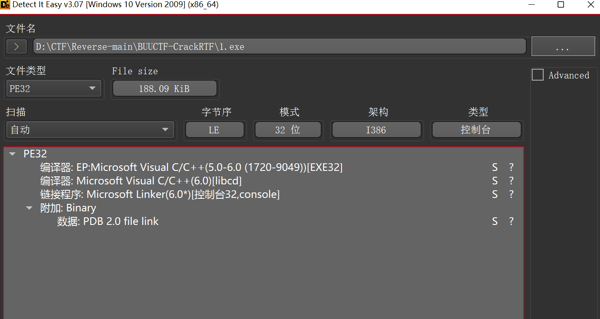
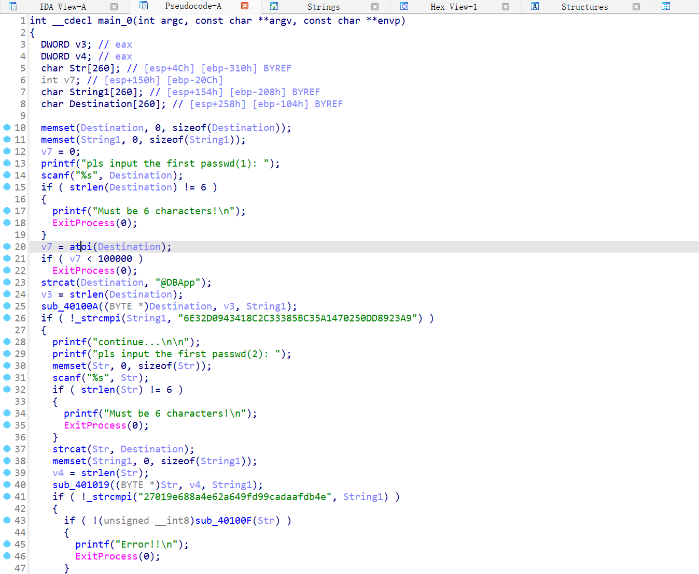
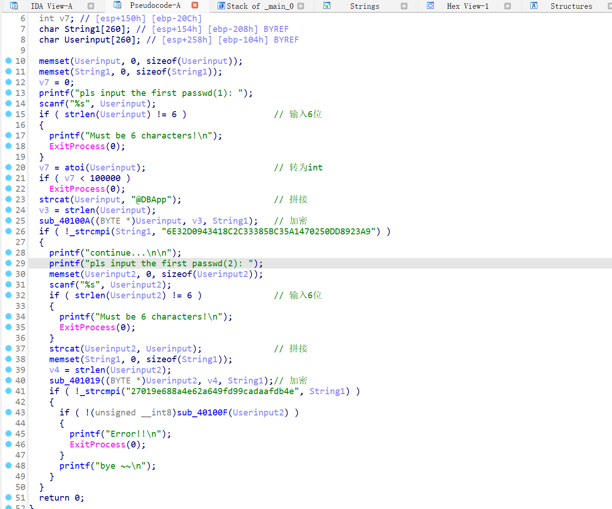
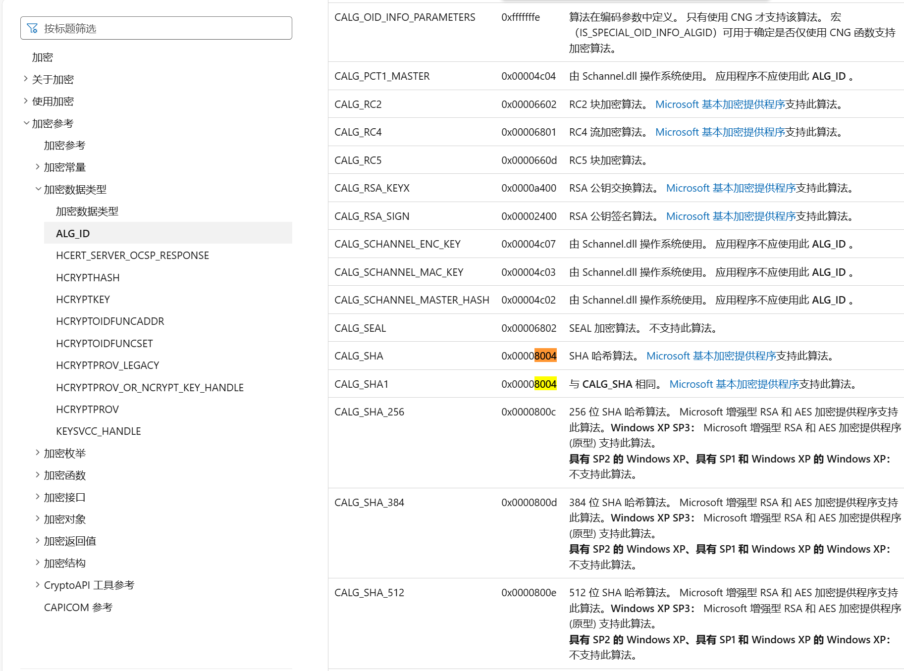
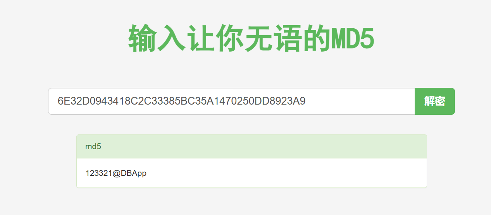
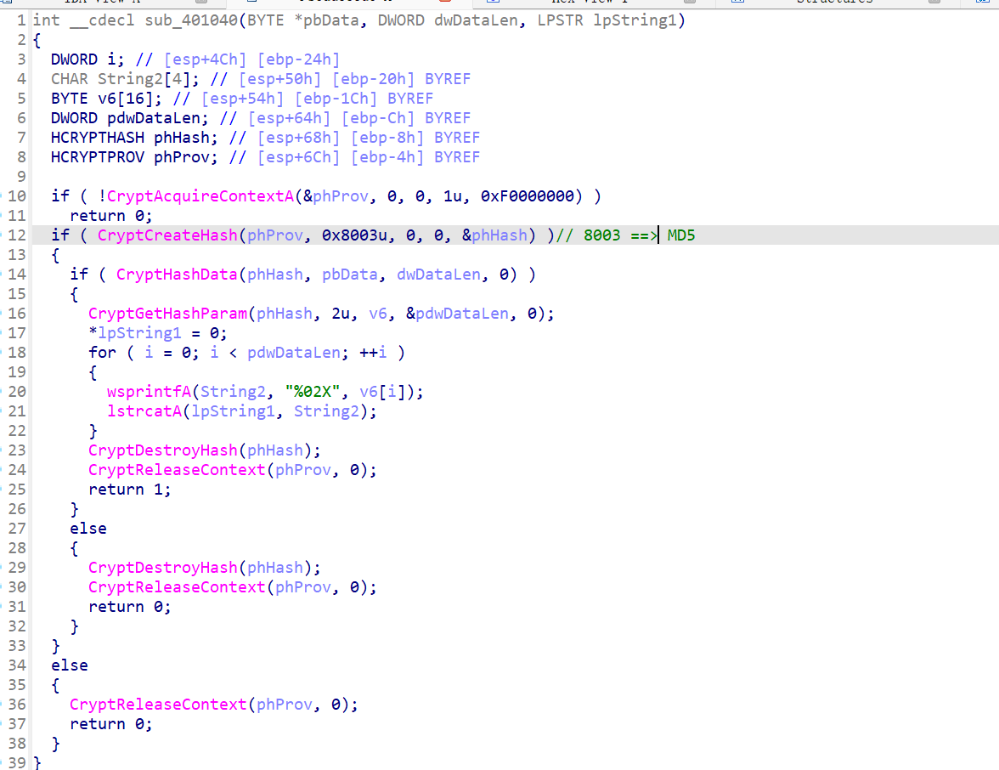
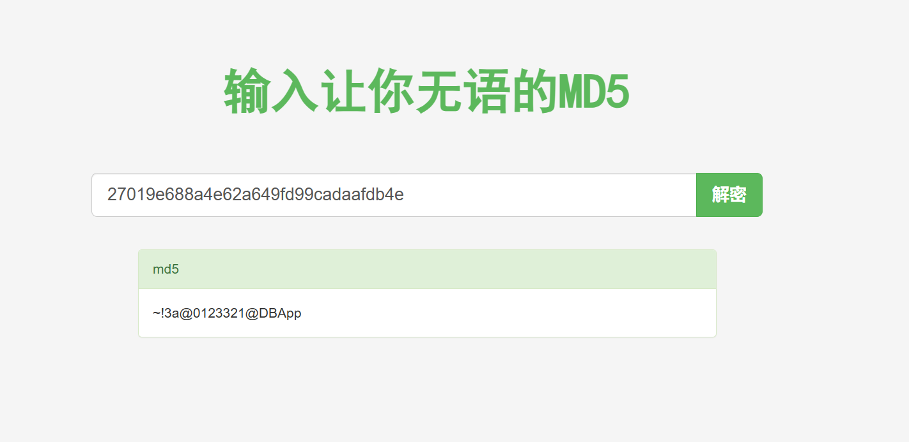
# [wp](https://www.bilibili.com/video/BV1GS4y1L7fW?spm_id_from=333.788.videopod.sections&vd_source=2c4148ac928a1b2447f3d8c80156c3c4)

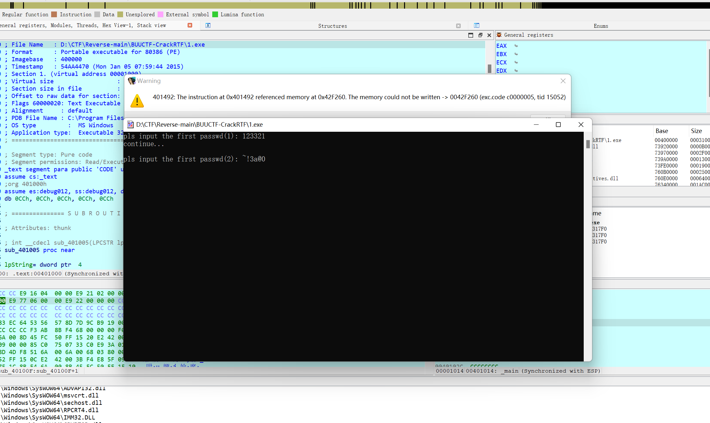
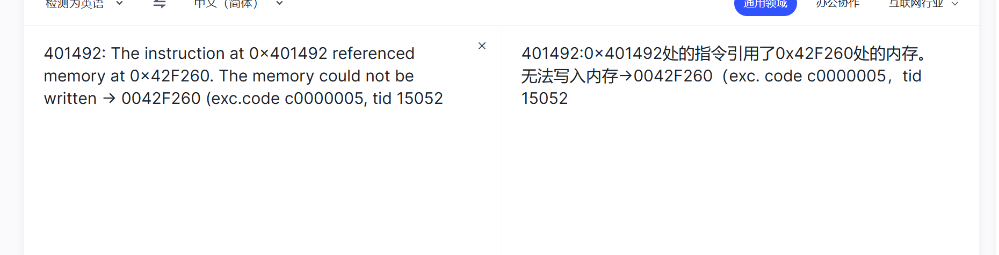
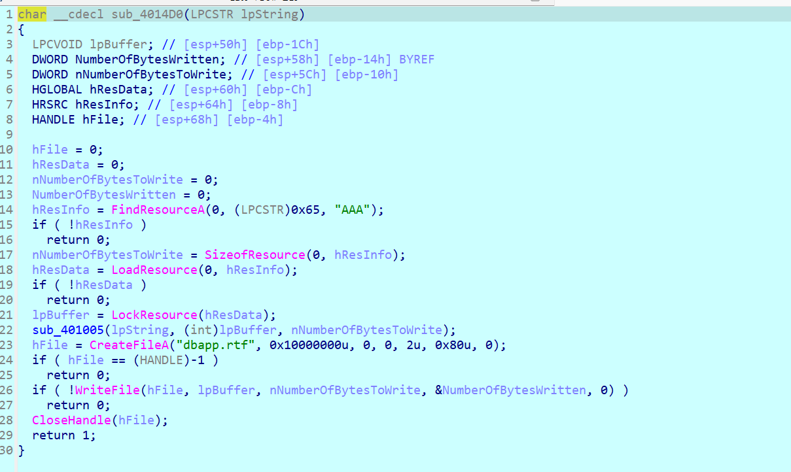
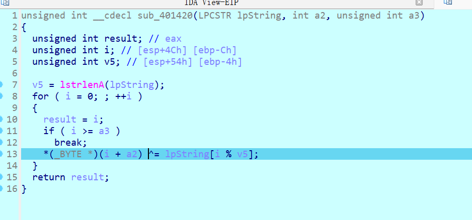
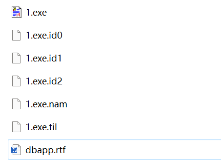
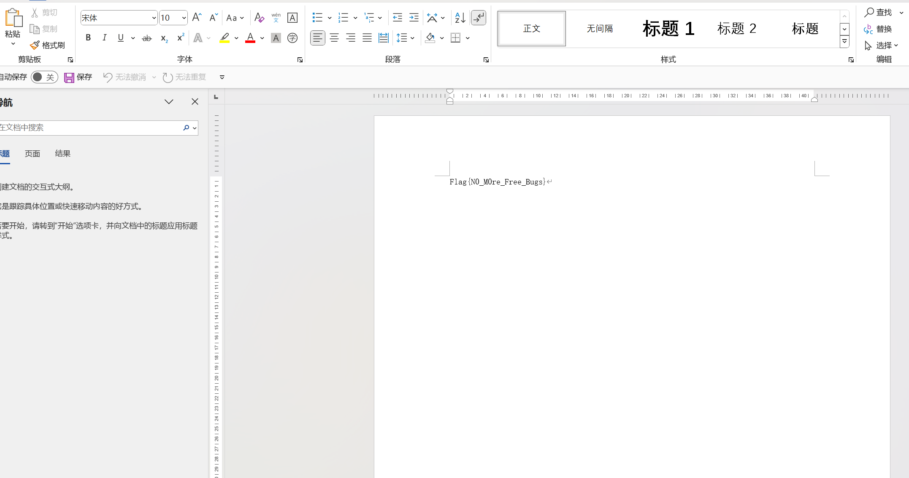
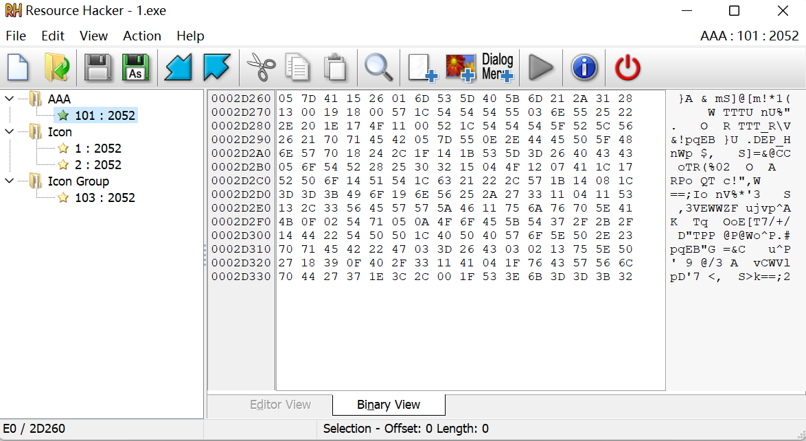
取前六位 05 7D 41 15 26 01 ，和 rtf 文件头7B 5C 72 74 66 31两者进行异或得到 ~!3a@0

G

0x42f260


0xe0
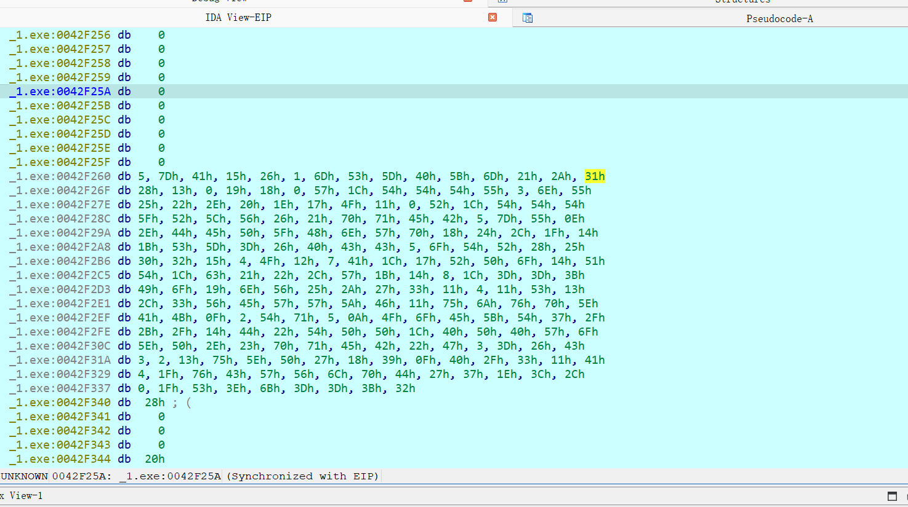

shift + E

```python
data = [
    0x05, 0x7D, 0x41, 0x15, 0x26, 0x01, 0x6D, 0x53, 0x5D, 0x40,
    0x5B, 0x6D, 0x21, 0x2A, 0x31, 0x28, 0x13, 0x00, 0x19, 0x18,
    0x00, 0x57, 0x1C, 0x54, 0x54, 0x54, 0x55, 0x03, 0x6E, 0x55,
    0x25, 0x22, 0x2E, 0x20, 0x1E, 0x17, 0x4F, 0x11, 0x00, 0x52,
    0x1C, 0x54, 0x54, 0x54, 0x5F, 0x52, 0x5C, 0x56, 0x26, 0x21,
    0x70, 0x71, 0x45, 0x42, 0x05, 0x7D, 0x55, 0x0E, 0x2E, 0x44,
    0x45, 0x50, 0x5F, 0x48, 0x6E, 0x57, 0x70, 0x18, 0x24, 0x2C,
    0x1F, 0x14, 0x1B, 0x53, 0x5D, 0x3D, 0x26, 0x40, 0x43, 0x43,
    0x05, 0x6F, 0x54, 0x52, 0x28, 0x25, 0x30, 0x32, 0x15, 0x04,
    0x4F, 0x12, 0x07, 0x41, 0x1C, 0x17, 0x52, 0x50, 0x6F, 0x14,
    0x51, 0x54, 0x1C, 0x63, 0x21, 0x22, 0x2C, 0x57, 0x1B, 0x14,
    0x08, 0x1C, 0x3D, 0x3D, 0x3B, 0x49, 0x6F, 0x19, 0x6E, 0x56,
    0x25, 0x2A, 0x27, 0x33, 0x11, 0x04, 0x11, 0x53, 0x13, 0x2C,
    0x33, 0x56, 0x45, 0x57, 0x57, 0x5A, 0x46, 0x11, 0x75, 0x6A,
    0x76, 0x70, 0x5E, 0x41, 0x4B, 0x0F, 0x02, 0x54, 0x71, 0x05,
    0x0A, 0x4F, 0x6F, 0x45, 0x5B, 0x54, 0x37, 0x2F, 0x2B, 0x2F,
    0x14, 0x44, 0x22, 0x54, 0x50, 0x50, 0x1C, 0x40, 0x50, 0x40,
    0x57, 0x6F, 0x5E, 0x50, 0x2E, 0x23, 0x70, 0x71, 0x45, 0x42,
    0x22, 0x47, 0x03, 0x3D, 0x26, 0x43, 0x03, 0x02, 0x13, 0x75,
    0x5E, 0x50, 0x27, 0x18, 0x39, 0x0F, 0x40, 0x2F, 0x33, 0x11,
    0x41, 0x04, 0x1F, 0x76, 0x43, 0x57, 0x56, 0x6C, 0x70, 0x44,
    0x27, 0x37, 0x1E, 0x3C, 0x2C, 0x00, 0x1F, 0x53, 0x3E, 0x6B,
    0x3D, 0x3D, 0x3B, 0x32
]

key = '~!3a@0123321@DBApp'

for i in range(len(data)):
    data[i] = chr(data[i] ^ ord(key[i % len(key)]))

print(''.join(data))

# Flag\{N0_M0re_Free_Bugs\}
# Flag{N0_M0re_Free_Bugs}
```