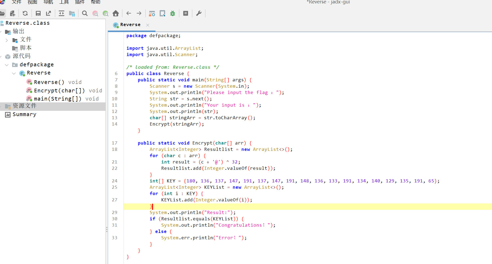

**用jadx-gui打开**
---


**脚本**
---
```python
xor_flag = [
    180, 136, 137, 147, 191, 137, 147, 191, 148, 136, 133, 191, 134, 140, 129, 135, 191, 65
]
flag = ''
for i in xor_flag:
    flag += chr((i ^ 32) - ord('@'))

print(flag)
# This_is_the_flag_!
# flag{This_is_the_flag_!}
```