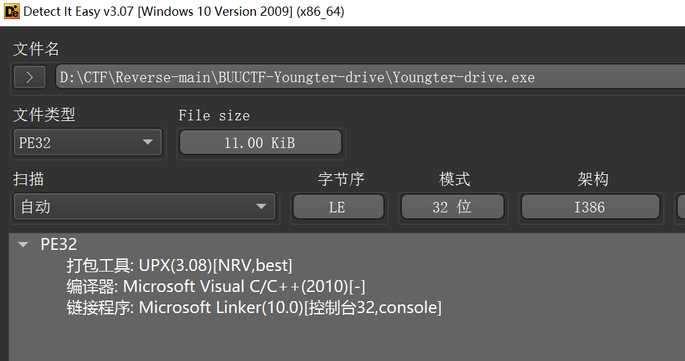
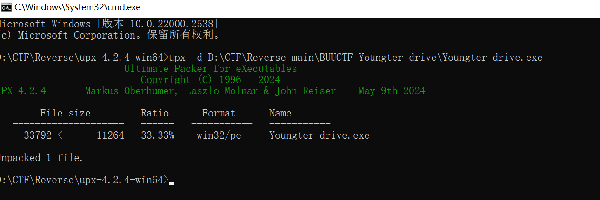
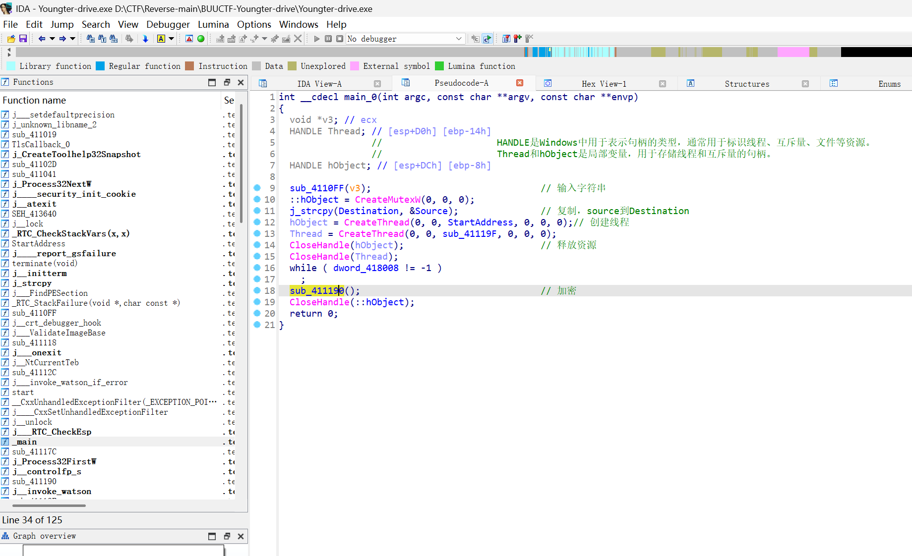
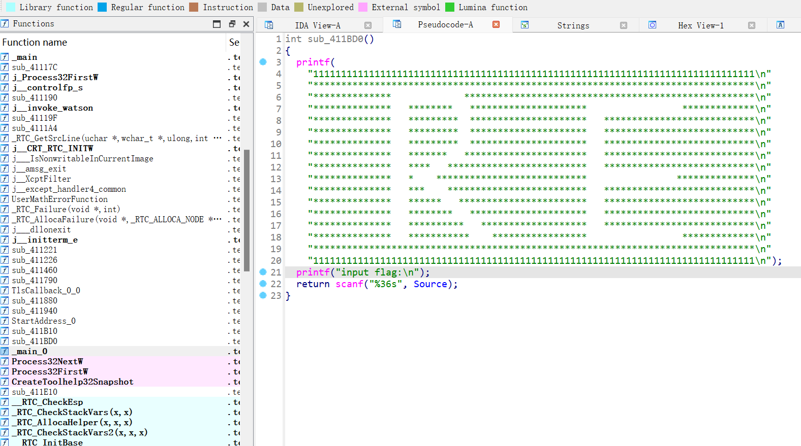
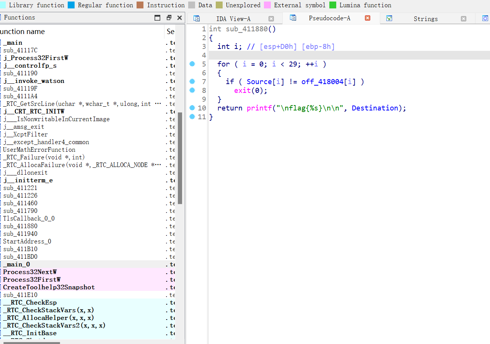
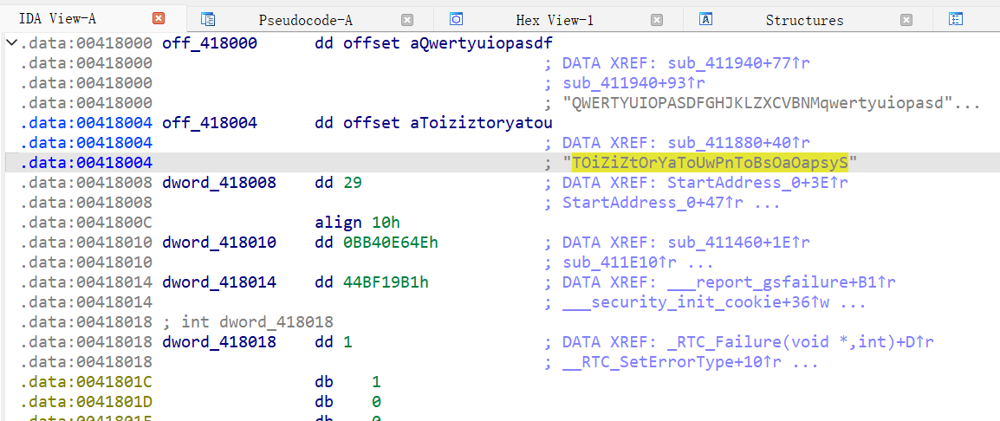
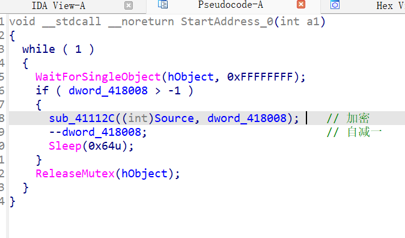
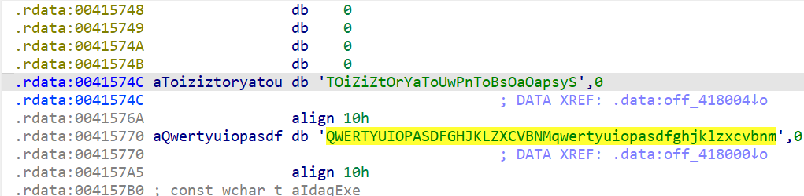
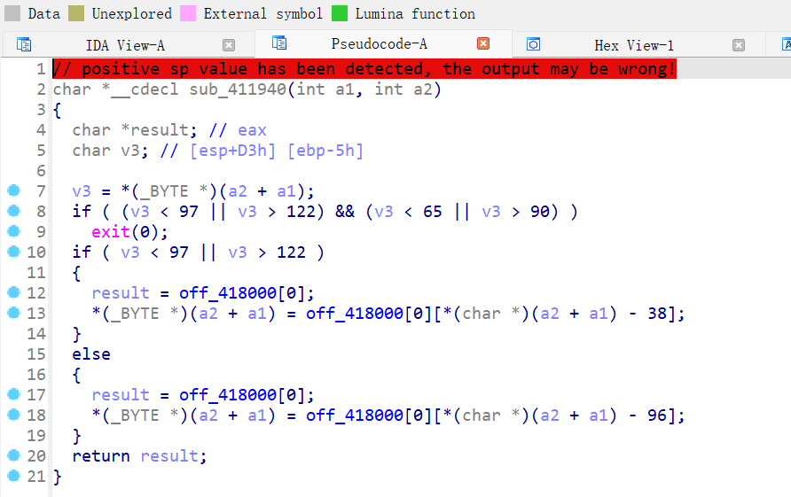

**查壳，upx并脱壳**




---




输入的flag，（即Source）


此处是加密后的flag,即Destination




按`X`,交叉引用，看看Source在哪被加密





```python
en_flag = "TOiZiZtOrYaToUwPnToBsOaOapsyS"
a2 = "QWERTYUIOPASDFGHJKLZXCVBNMqwertyuiopasdfghjklzxcvbnm
flag=''

for i in range(len(en_flag)):
    if i % 2 == 0:
        flag += en_flag[i]
        continue
    for j,k in enumerate(a2):
        if en_flag[i] == k:
            if chr(j+38).isupper():
                flag += chr(j+38)
            else:
                flag += chr(j+96)

print flag

```