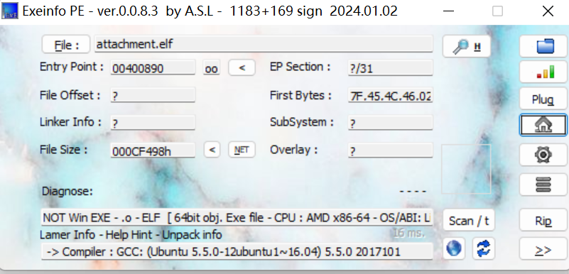
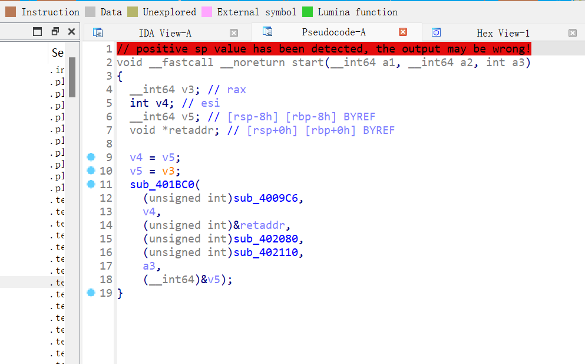
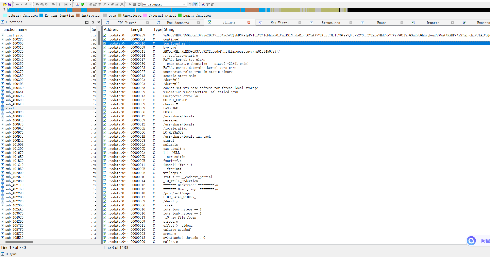
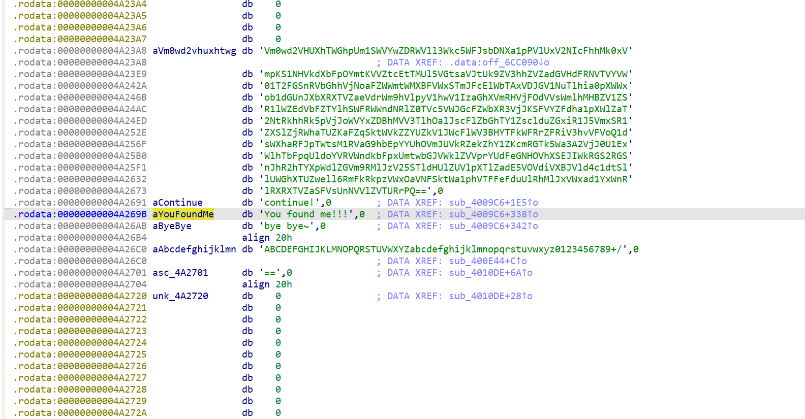
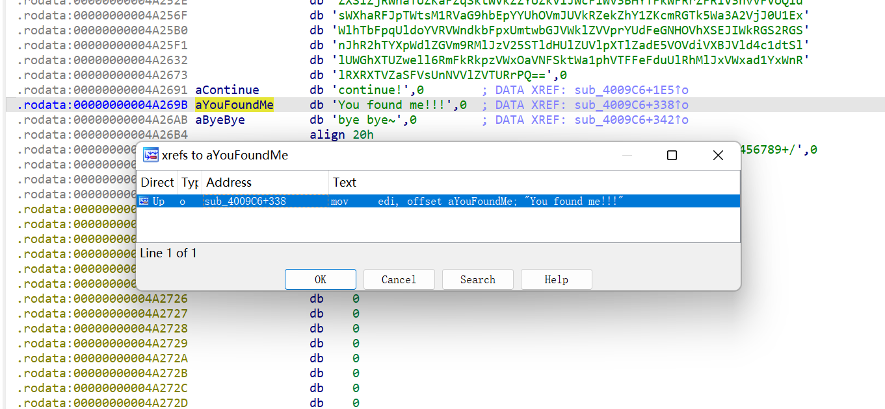
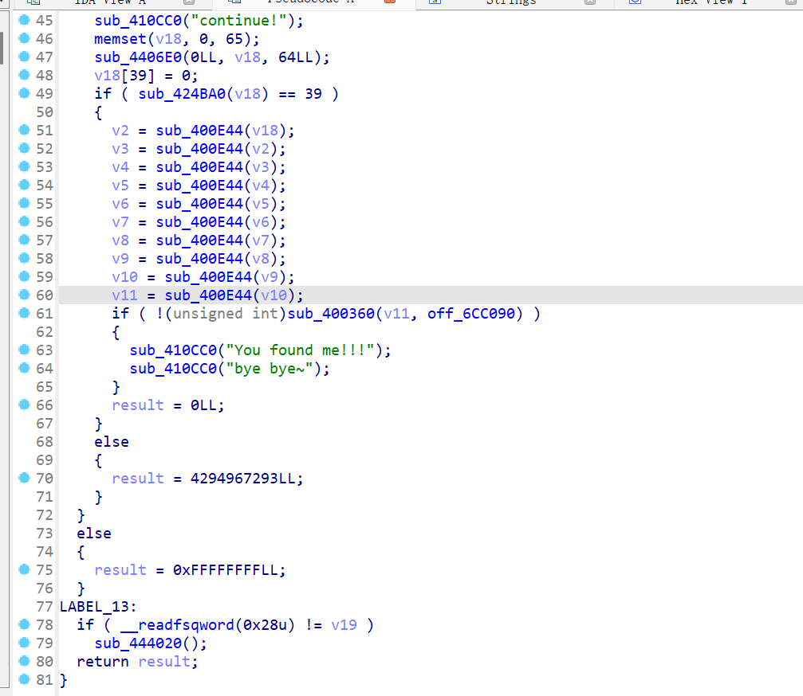
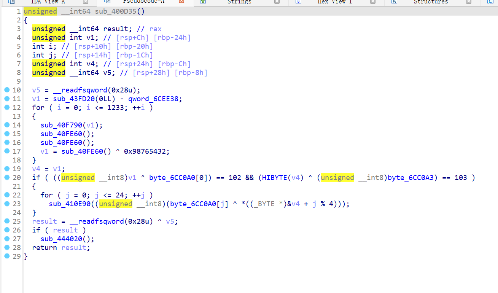
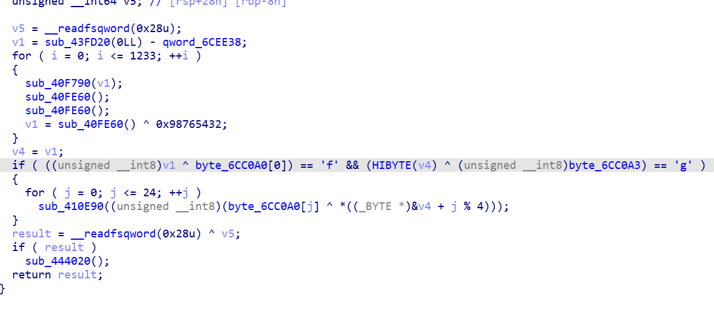
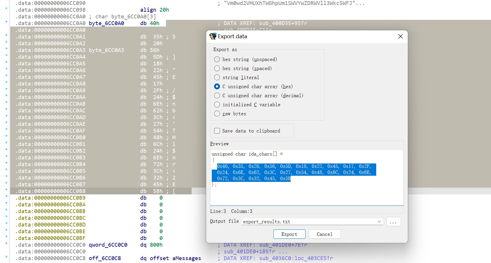

[BUUCTF-[2019红帽杯]easyRE(Reverse逆向)](https://blog.csdn.net/m0_64696290/article/details/136430440?ops_request_misc=%257B%2522request%255Fid%2522%253A%2522986049B7-90C6-45C8-9F04-AD9D4D913DF9%2522%252C%2522scm%2522%253A%252220140713.130102334..%2522%257D&request_id=986049B7-90C6-45C8-9F04-AD9D4D913DF9&biz_id=0&utm_medium=distribute.pc_search_result.none-task-blog-2~all~sobaiduend~default-1-136430440-null-null.142^v100^pc_search_result_base6&utm_term=buuctf%20%5B2019%E7%BA%A2%E5%B8%BD%E6%9D%AF%5Deasyre&spm=1018.2226.3001.4187)
```python
input1=''
v12='73 111 100 108 62 81 110 98 40 111 99 121 127 121 46 105 127 100 96 51 119 125 119 101 107 57 123 105 121 61 126 121 76 64 69 67'.split(' ')
for i in range(len(v12)):
    input1+=chr(int(v12[i])^i)
print(input1)
 
#输出为Info:The first four chars are `flag`
```




```python
#求v4数组
str1 = 'flag'
v4 = ''
str2 = [0x40, 0x35, 0x20, 0x56, 0x5D, 0x18, 0x22, 0x45, 0x17, 0x2F,
        0x24, 0x6E, 0x62, 0x3C, 0x27, 0x54, 0x48, 0x6C, 0x24, 0x6E,
        0x72, 0x3C, 0x32, 0x45, 0x5B]
for i in range(4):
    v4 += chr(ord(str1[i]) ^ str2[i])
# 求flag
flag = ''
for i in range(len(str2)):
    flag += chr(ord(v4[i % 4]) ^ str2[i])
print(flag)
# flag{Act1ve_Defen5e_Test}
```