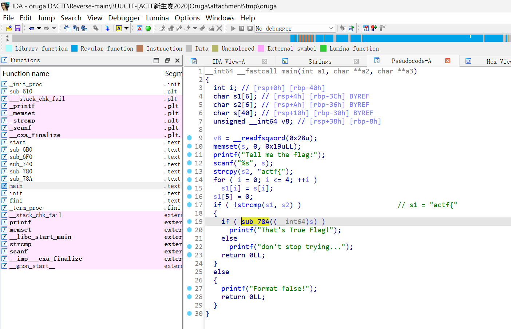
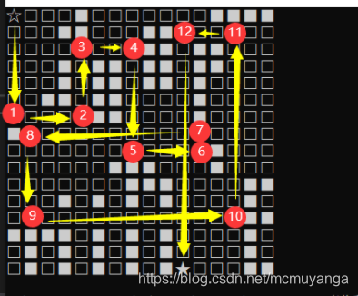
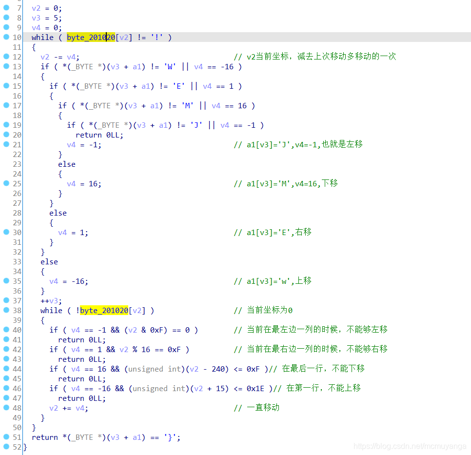

**迷宫题，与常规迷宫有点不一样**




```c
unsigned char ida_chars_byte_201020[] =
{
  0x00, 0x00, 0x00, 0x00, 0x23, 0x00, 0x00, 0x00, 0x00, 0x00, 
  0x00, 0x00, 0x23, 0x23, 0x23, 0x23, 0x00, 0x00, 0x00, 0x23, 
  0x23, 0x00, 0x00, 0x00, 0x4F, 0x4F, 0x00, 0x00, 0x00, 0x00, 
  0x00, 0x00, 0x00, 0x00, 0x00, 0x00, 0x00, 0x00, 0x00, 0x00, 
  0x4F, 0x4F, 0x00, 0x50, 0x50, 0x00, 0x00, 0x00, 0x00, 0x00, 
  0x00, 0x4C, 0x00, 0x4F, 0x4F, 0x00, 0x4F, 0x4F, 0x00, 0x50, 
  0x50, 0x00, 0x00, 0x00, 0x00, 0x00, 0x00, 0x4C, 0x00, 0x4F, 
  0x4F, 0x00, 0x4F, 0x4F, 0x00, 0x50, 0x00, 0x00, 0x00, 0x00, 
  0x00, 0x00, 0x4C, 0x4C, 0x00, 0x4F, 0x4F, 0x00, 0x00, 0x00, 
  0x00, 0x50, 0x00, 0x00, 0x00, 0x00, 0x00, 0x00, 0x00, 0x00, 
  0x00, 0x4F, 0x4F, 0x00, 0x00, 0x00, 0x00, 0x50, 0x00, 0x00, 
  0x00, 0x00, 0x23, 0x00, 0x00, 0x00, 0x00, 0x00, 0x00, 0x00, 
  0x00, 0x00, 0x00, 0x00, 0x00, 0x00, 0x00, 0x00, 0x00, 0x00, 
  0x00, 0x00, 0x00, 0x00, 0x00, 0x00, 0x00, 0x00, 0x00, 0x00, 
  0x23, 0x00, 0x00, 0x00, 0x00, 0x00, 0x00, 0x00, 0x00, 0x00, 
  0x4D, 0x4D, 0x4D, 0x00, 0x00, 0x00, 0x23, 0x00, 0x00, 0x00, 
  0x00, 0x00, 0x00, 0x00, 0x00, 0x00, 0x00, 0x4D, 0x4D, 0x4D, 
  0x00, 0x00, 0x00, 0x00, 0x45, 0x45, 0x00, 0x00, 0x00, 0x30, 
  0x00, 0x4D, 0x00, 0x4D, 0x00, 0x4D, 0x00, 0x00, 0x00, 0x00, 
  0x45, 0x00, 0x00, 0x00, 0x00, 0x00, 0x00, 0x00, 0x00, 0x00, 
  0x00, 0x00, 0x00, 0x00, 0x00, 0x00, 0x45, 0x45, 0x54, 0x54, 
  0x54, 0x49, 0x00, 0x4D, 0x00, 0x4D, 0x00, 0x4D, 0x00, 0x00, 
  0x00, 0x00, 0x45, 0x00, 0x00, 0x54, 0x00, 0x49, 0x00, 0x4D, 
  0x00, 0x4D, 0x00, 0x4D, 0x00, 0x00, 0x00, 0x00, 0x45, 0x00, 
  0x00, 0x54, 0x00, 0x49, 0x00, 0x4D, 0x00, 0x4D, 0x00, 0x4D, 
  0x21, 0x00, 0x00, 0x00, 0x45, 0x45
};
```

```python
# maze_str_to_list
maze_str = ("    #       ####   ##   OO              OO PP      L OO OO PP      L OO OO P      LL OO    P         OO    P    #                           #         MMM   #          MMM    EE   0 M M M    E               EETTTI M M M    E  T I M M M    E  T I M M M!   EE")
print(len(maze_str))
index = 0
row = 16
col = 16
maze = []
for i in range(row):
    tmp = []
    for j in range(col):
        tmp.append(maze_str[index])
        index += 1
    maze.append(tmp)
print(maze)

# 256
# [
#     [' ', ' ', ' ', ' ', '#', ' ', ' ', ' ', ' ', ' ', ' ', ' ', '#', '#', '#', '#'], 
#     [' ', ' ', ' ', '#', '#', ' ', ' ', ' ', 'O', 'O', ' ', ' ', ' ', ' ', ' ', ' '], 
#     [' ', ' ', ' ', ' ', ' ', ' ', ' ', ' ', 'O', 'O', ' ', 'P', 'P', ' ', ' ', ' '], 
#     [' ', ' ', ' ', 'L', ' ', 'O', 'O', ' ', 'O', 'O', ' ', 'P', 'P', ' ', ' ', ' '], 
#     [' ', ' ', ' ', 'L', ' ', 'O', 'O', ' ', 'O', 'O', ' ', 'P', ' ', ' ', ' ', ' '], 
#     [' ', ' ', 'L', 'L', ' ', 'O', 'O', ' ', ' ', ' ', ' ', 'P', ' ', ' ', ' ', ' '], 
#     [' ', ' ', ' ', ' ', ' ', 'O', 'O', ' ', ' ', ' ', ' ', 'P', ' ', ' ', ' ', ' '],
#     ['#', ' ', ' ', ' ', ' ', ' ', ' ', ' ', ' ', ' ', ' ', ' ', ' ', ' ', ' ', ' '],
#     [' ', ' ', ' ', ' ', ' ', ' ', ' ', ' ', ' ', ' ', ' ', ' ', '#', ' ', ' ', ' '], 
#     [' ', ' ', ' ', ' ', ' ', ' ', 'M', 'M', 'M', ' ', ' ', ' ', '#', ' ', ' ', ' '], 
#     [' ', ' ', ' ', ' ', ' ', ' ', ' ', 'M', 'M', 'M', ' ', ' ', ' ', ' ', 'E', 'E'], 
#     [' ', ' ', ' ', '0', ' ', 'M', ' ', 'M', ' ', 'M', ' ', ' ', ' ', ' ', 'E', ' '], 
#     [' ', ' ', ' ', ' ', ' ', ' ', ' ', ' ', ' ', ' ', ' ', ' ', ' ', ' ', 'E', 'E'], 
#     ['T', 'T', 'T', 'I', ' ', 'M', ' ', 'M', ' ', 'M', ' ', ' ', ' ', ' ', 'E', ' '], 
#     [' ', 'T', ' ', 'I', ' ', 'M', ' ', 'M', ' ', 'M', ' ', ' ', ' ', ' ', 'E', ' '], 
#     [' ', 'T', ' ', 'I', ' ', 'M', ' ', 'M', ' ', 'M', '!', ' ', ' ', ' ', 'E', 'E']

# ]
# 起点' '（0，0） ，终点'!'（15,10）
```
同一障碍为`#`以便后续脚本

```python
maze_str = ("    #       ####   ##   OO              OO PP      L OO OO PP      L OO OO P      LL OO    P         OO    P    #                           #         MMM   #          MMM    EE   0 M M M    E               EETTTI M M M    E  T I M M M    E  T I M M M!   EE")
print(len(maze_str))
index = 0
row = 16
col = 16
maze = []
for i in range(row):
    tmp = []
    for j in range(col):
        if maze_str[index] == '!' or maze_str[index] == ' ':
            tmp.append(maze_str[index])
        else:
            tmp.append('#')
        index += 1
    maze.append(tmp)
print(maze)
# 256
# [
#     [' ', ' ', ' ', ' ', '#', ' ', ' ', ' ', ' ', ' ', ' ', ' ', '#', '#', '#', '#'], 
#     [' ', ' ', ' ', '#', '#', ' ', ' ', ' ', '#', '#', ' ', ' ', ' ', ' ', ' ', ' '], 
#     [' ', ' ', ' ', ' ', ' ', ' ', ' ', ' ', '#', '#', ' ', '#', '#', ' ', ' ', ' '], 
#     [' ', ' ', ' ', '#', ' ', '#', '#', ' ', '#', '#', ' ', '#', '#', ' ', ' ', ' '], 
#     [' ', ' ', ' ', '#', ' ', '#', '#', ' ', '#', '#', ' ', '#', ' ', ' ', ' ', ' '], 
#     [' ', ' ', '#', '#', ' ', '#', '#', ' ', ' ', ' ', ' ', '#', ' ', ' ', ' ', ' '], 
#     [' ', ' ', ' ', ' ', ' ', '#', '#', ' ', ' ', ' ', ' ', '#', ' ', ' ', ' ', ' '], 
#     ['#', ' ', ' ', ' ', ' ', ' ', ' ', ' ', ' ', ' ', ' ', ' ', ' ', ' ', ' ', ' '], 
#     [' ', ' ', ' ', ' ', ' ', ' ', ' ', ' ', ' ', ' ', ' ', ' ', '#', ' ', ' ', ' '], 
#     [' ', ' ', ' ', ' ', ' ', ' ', '#', '#', '#', ' ', ' ', ' ', '#', ' ', ' ', ' '], 
#     [' ', ' ', ' ', ' ', ' ', ' ', ' ', '#', '#', '#', ' ', ' ', ' ', ' ', '#', '#'], 
#     [' ', ' ', ' ', '#', ' ', '#', ' ', '#', ' ', '#', ' ', ' ', ' ', ' ', '#', ' '], 
#     [' ', ' ', ' ', ' ', ' ', ' ', ' ', ' ', ' ', ' ', ' ', ' ', ' ', ' ', '#', '#'], 
#     ['#', '#', '#', '#', ' ', '#', ' ', '#', ' ', '#', ' ', ' ', ' ', ' ', '#', ' '], 
#     [' ', '#', ' ', '#', ' ', '#', ' ', '#', ' ', '#', ' ', ' ', ' ', ' ', '#', ' '], 
#     [' ', '#', ' ', '#', ' ', '#', ' ', '#', ' ', '#', '!', ' ', ' ', ' ', '#', '#']
# ]
```
向下移动：M

向左移动：J

向上移动：E

向右移动：W

`flag{MEWEMEWJMEWJM}`
.png>)
```python

```