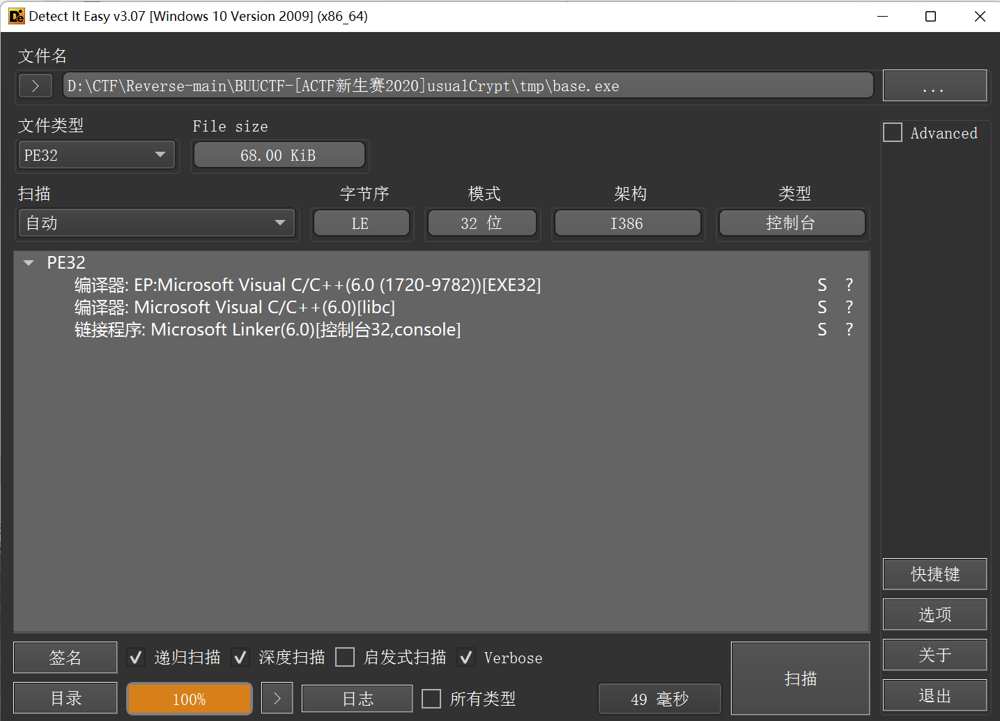
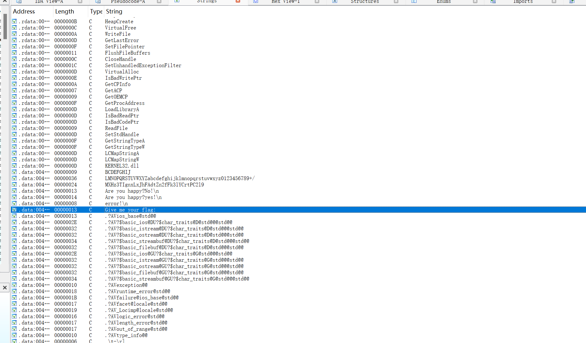
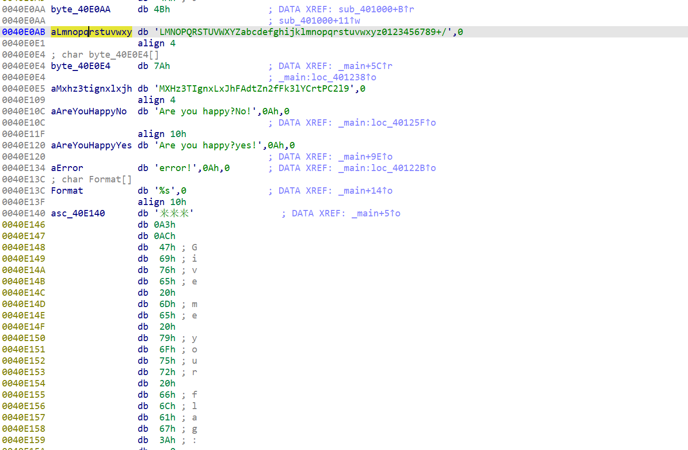

[[ACTF新生赛2020] usualCrypt](https://blog.csdn.net/weixin_74305514/article/details/136468036?ops_request_misc=%257B%2522request%255Fid%2522%253A%25221079F1E6-EE7F-4C58-8B7D-1E85AD1970A6%2522%252C%2522scm%2522%253A%252220140713.130102334..%2522%257D&request_id=1079F1E6-EE7F-4C58-8B7D-1E85AD1970A6&biz_id=0&utm_medium=distribute.pc_search_result.none-task-blog-2~all~sobaiduend~default-1-136468036-null-null.142^v100^pc_search_result_base6&utm_term=%5BACTF%E6%96%B0%E7%94%9F%E8%B5%9B2020%5DusualCrypt&spm=1018.2226.3001.4187)

    加密流程就是 明文->更换base64加密表->用换了的表对明文进行加密->大小写转换->密文。