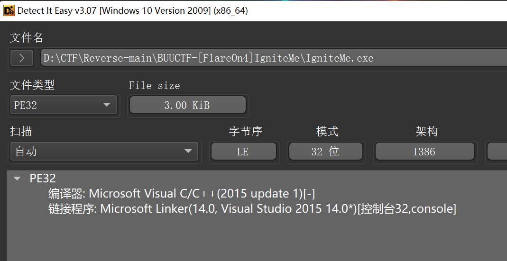
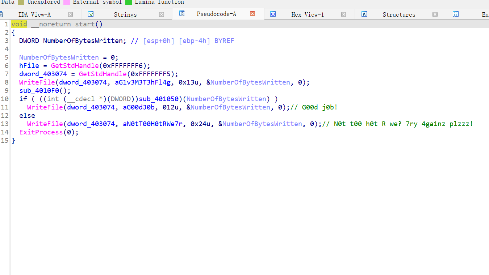
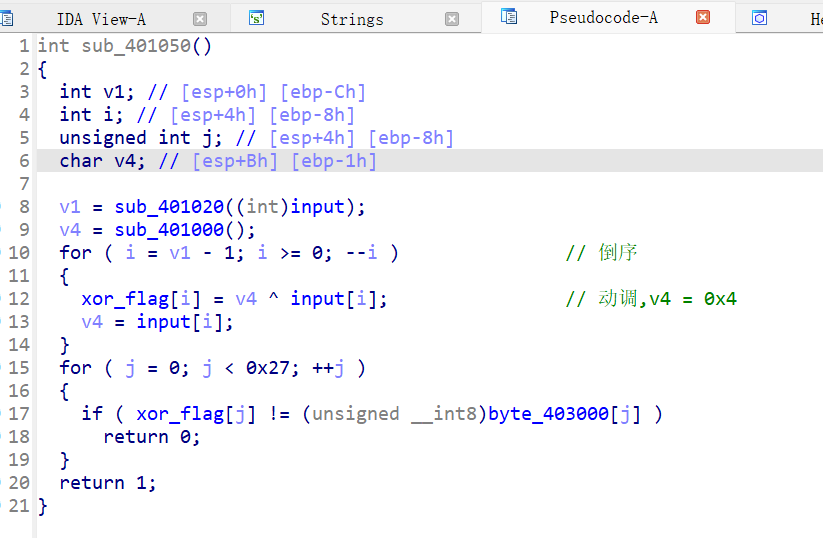
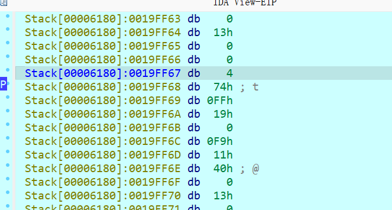

在`xor_flag[i] = v4 ^ input[i]`处下断点，动态调试后就可以看到v4的值了，
（把鼠标放v4上就可以显示值），不好截图，双击v4也可以看到值为4


最后,从`最后一个`开始异或`前一个`的运算

易错的是，`v4 = a[i] ^ v4`,之前写成`v4 = a[i]`卡了好久

```
a = [
  0x0D, 0x26, 0x49, 0x45, 0x2A, 0x17, 0x78, 0x44, 0x2B, 0x6C, 
  0x5D, 0x5E, 0x45, 0x12, 0x2F, 0x17, 0x2B, 0x44, 0x6F, 0x6E, 
  0x56, 0x09, 0x5F, 0x45, 0x47, 0x73, 0x26, 0x0A, 0x0D, 0x13, 
  0x17, 0x48, 0x42, 0x01, 0x40, 0x4D, 0x0C, 0x02, 0x69
]
v4 = 0x4
flag = ''
for i in range(len(a) - 1, 0, -1):
    flag += chr(a[i] ^ v4)
    v4 = a[i] ^ v4

print(flag[::-1])
# _y0u_H0t_3n0ugH_t0_1gn1t3@flare-on.com

```