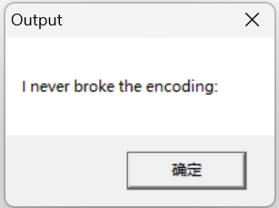

```c
int __stdcall start(int a1, int a2, int a3, int a4)
{
  char Text[128]; // [esp+0h] [ebp-84h] BYREF
  unsigned int v6; // [esp+80h] [ebp-4h]

  v6 = sub_401160(Text, (int)&unk_402008, 28u);
  Text[v6] = 0;
  MessageBoxA(0, Text, Caption, 0);
  return 0;
}
```

```c
unsigned int __cdecl sub_401160(char *a1, char *a2, unsigned int a3)
{
  unsigned int i; // [esp+4h] [ebp-4h]

  for ( i = 0; i < a3; ++i )
  {
    a2 += sub_401000(a1, a2);
    if ( !*a1++ )
      break;
  }
  return i;
}
```

```c
int __cdecl sub_401000(unsigned __int8 *a1, char *a2)
{
  int v3; // [esp+0h] [ebp-8h]
  unsigned __int8 v4; // [esp+4h] [ebp-4h]

  if ( (int)(unsigned __int8)*a2 >> 3 == 30 )
  {
    v4 = a2[3] & 0x3F | ((a2[2] & 0x3F) << 6);
    v3 = 4;
  }
  else if ( (int)(unsigned __int8)*a2 >> 4 == 14 )
  {
    v4 = a2[2] & 0x3F | ((a2[1] & 0x3F) << 6);
    v3 = 3;
  }
  else if ( (int)(unsigned __int8)*a2 >> 5 == 6 )
  {
    v4 = a2[1] & 0x3F | ((*a2 & 0x1F) << 6);
    v3 = 2;
  }
  else
  {
    v4 = *a2;
    v3 = 1;
  }
  *a1 = v4;
  return v3;
}
```

```python
a2 = [0xe0, 0x81, 0x89, 0xc0, 0xa0, 0xc1, 0xae, 0xe0, 0x81, 0xa5,
      0xc1, 0xb6, 0xf0, 0x80, 0x81, 0xa5, 0xe0, 0x81, 0xb2, 0xf0,
      0x80, 0x80, 0xa0, 0xe0, 0x81, 0xa2, 0x72, 0x6f, 0xc1, 0xab,
      0x65, 0xe0, 0x80, 0xa0, 0xe0, 0x81, 0xb4, 0xe0, 0x81, 0xa8,
      0xc1, 0xa5, 0x20, 0xc1, 0xa5, 0xe0, 0x81, 0xae, 0x63, 0xc1,
      0xaf, 0xe0, 0x81, 0xa4, 0xf0, 0x80, 0x81, 0xa9, 0x6e, 0xc1,
      0xa7, 0xc0, 0xba, 0x20, 0x49, 0xf0, 0x80, 0x81, 0x9f, 0xc1,
      0xa1, 0xc1, 0x9f, 0xc1, 0x8d, 0xe0, 0x81, 0x9f, 0xc1, 0xb4,
      0xf0, 0x80, 0x81, 0x9f, 0xf0, 0x80, 0x81, 0xa8, 0xc1, 0x9f,
      0xf0, 0x80, 0x81, 0xa5, 0xe0, 0x81, 0x9f, 0xc1, 0xa5, 0xe0,
      0x81, 0x9f, 0xf0, 0x80, 0x81, 0xae, 0xc1, 0x9f, 0xf0, 0x80,
      0x81, 0x83, 0xc1, 0x9f, 0xe0, 0x81, 0xaf, 0xe0, 0x81, 0x9f,
      0xc1, 0x84, 0x5f, 0xe0, 0x81, 0xa9, 0xf0, 0x80, 0x81, 0x9f,
      0x6e, 0xe0, 0x81, 0x9f, 0xe0, 0x81, 0xa7, 0xe0, 0x81, 0x80,
      0xf0, 0x80, 0x81, 0xa6, 0xf0, 0x80, 0x81, 0xac, 0xe0, 0x81,
      0xa1, 0xc1, 0xb2, 0xc1, 0xa5, 0xf0, 0x80, 0x80, 0xad, 0xf0,
      0x80, 0x81, 0xaf, 0x6e, 0xc0, 0xae, 0xf0, 0x80, 0x81, 0xa3,
      0x6f, 0xf0, 0x80, 0x81, 0xad, 0x0]
flag = []
j = 0
for i in range(68):
    if a2[j] >> 3 == 30:
        v4 = a2[j + 3] & 0x3f | ((a2[j + 2] & 0x3f) << 6)
        v3 = 4
    elif a2[j] >> 4 == 14:
        v4 = a2[j + 2] & 0x3F | ((a2[j + 1] & 0x3F) << 6)
        v3 = 3
    elif a2[j] >> 5 == 6:
        v4 = a2[j + 1] & 0x3F | ((a2[j] & 0x1F) << 6)
        v3 = 2
    else:
        v4 = a2[j]
        v3 = 1
    flag.append(chr(v4))
    j += v3
for x in flag:
    print(x, end='')

# I never broke the encoding: I_a_M_t_h_e_e_n_C_o_D_i_n_g@flare-on.com
```

`flag{I_a_M_t_h_e_e_n_C_o_D_i_n_g@flare-on.com}`