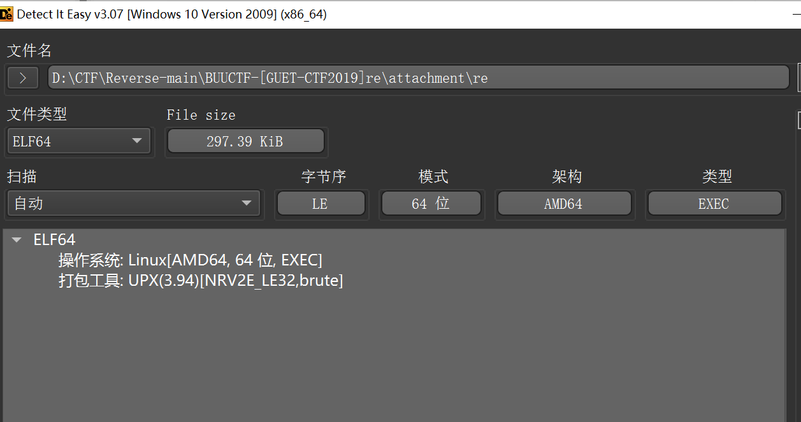
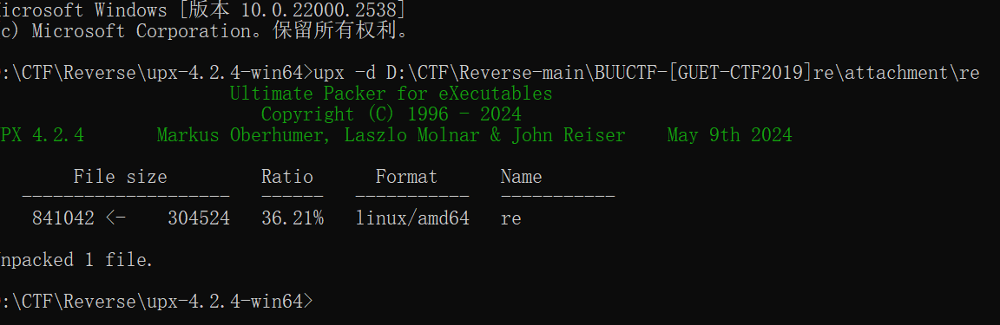
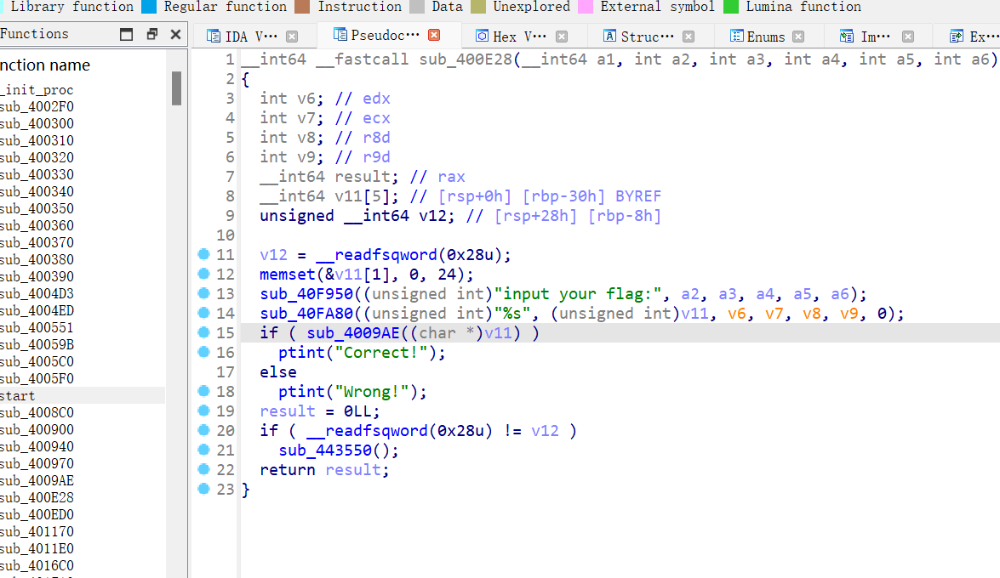

```c
_BOOL8 __fastcall sub_4009AE(char *a1)
{
  if ( 1629056 * *a1 != 166163712 )
    return 0LL;
  if ( 6771600 * a1[1] != 731332800 )
    return 0LL;
  if ( 3682944 * a1[2] != 357245568 )
    return 0LL;
  if ( 10431000 * a1[3] != 1074393000 )
    return 0LL;
  if ( 3977328 * a1[4] != 489211344 )
    return 0LL;
  if ( 5138336 * a1[5] != 518971936 )   # 这少了个a[6]
    return 0LL;
  if ( 7532250 * a1[7] != 406741500 )
    return 0LL;
  if ( 5551632 * a1[8] != 294236496 )
    return 0LL;
  if ( 3409728 * a1[9] != 177305856 )
    return 0LL;
  if ( 13013670 * a1[10] != 650683500 )
    return 0LL;
  if ( 6088797 * a1[11] != 298351053 )
    return 0LL;
  if ( 7884663 * a1[12] != 386348487 )
    return 0LL;
  if ( 8944053 * a1[13] != 438258597 )
    return 0LL;
  if ( 5198490 * a1[14] != 249527520 )
    return 0LL;
  if ( 4544518 * a1[15] != 445362764 )
    return 0LL;
  if ( 3645600 * a1[17] != 174988800 )
    return 0LL;
  if ( 10115280 * a1[16] != 981182160 )
    return 0LL;
  if ( 9667504 * a1[18] != 493042704 )
    return 0LL;
  if ( 5364450 * a1[19] != 257493600 )
    return 0LL;
  if ( 13464540 * a1[20] != 767478780 )
    return 0LL;
  if ( 5488432 * a1[21] != 312840624 )
    return 0LL;
  if ( 14479500 * a1[22] != 1404511500 )
    return 0LL;
  if ( 6451830 * a1[23] != 316139670 )
    return 0LL;
  if ( 6252576 * a1[24] != 619005024 )
    return 0LL;
  if ( 7763364 * a1[25] != 372641472 )
    return 0LL;
  if ( 7327320 * a1[26] != 373693320 )
    return 0LL;
  if ( 8741520 * a1[27] != 498266640 )
    return 0LL;
  if ( 8871876 * a1[28] != 452465676 )
    return 0LL;
  if ( 4086720 * a1[29] != 208422720 )
    return 0LL;
  if ( 9374400 * a1[30] == 515592000 )
    return 5759124 * a1[31] == 719890500;
  return 0LL;
}
```

```python
flag = ''
flag += chr(166163712 // 1629056)
flag += chr(731332800 // 6771600)
flag += chr(357245568 // 3682944)
flag += chr(1074393000 // 10431000)
flag += chr(489211344 // 3977328)
flag += chr(518971936 // 5138336)
flag += chr(406741500 // 7532250)
flag += chr(294236496 // 5551632)
flag += chr(177305856 // 3409728)
flag += chr(650683500 // 13013670)
flag += chr(298351053 // 6088797)
flag += chr(386348487 // 7884663)
flag += chr(438258597 // 8944053)
flag += chr(249527520 // 5198490)
flag += chr(445362764 // 4544518)
flag += chr(981182160 // 10115280)
flag += chr(174988800 // 3645600)
flag += chr(493042704 // 9667504)
flag += chr(257493600 // 5364450)
flag += chr(767478780 // 13464540)
flag += chr(312840624 // 5488432)
flag += chr(1404511500 // 14479500)
flag += chr(316139670 // 6451830)
flag += chr(619005024 // 6252576)
flag += chr(372641472 // 7763364)
flag += chr(373693320 // 7327320)
flag += chr(498266640 // 8741520)
flag += chr(452465676 // 8871876)
flag += chr(208422720 // 4086720)
flag += chr(515592000 // 9374400)
flag += chr(719890500 // 5759124)
for i in range(1, 10):
    flag1 = flag[:6] + str(i) + flag[6:]
    print(flag1)


"""
flag{e165421110ba03099a1c039337}  这个
flag{e265421110ba03099a1c039337}
flag{e365421110ba03099a1c039337}
flag{e465421110ba03099a1c039337}
flag{e565421110ba03099a1c039337}
flag{e665421110ba03099a1c039337}
flag{e765421110ba03099a1c039337}
flag{e865421110ba03099a1c039337}
flag{e965421110ba03099a1c039337}
"""
```

建议学一下python z3约束求解器
