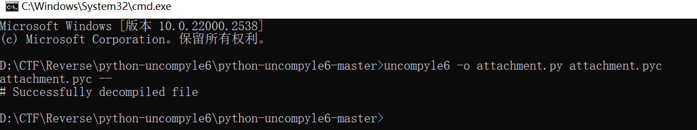
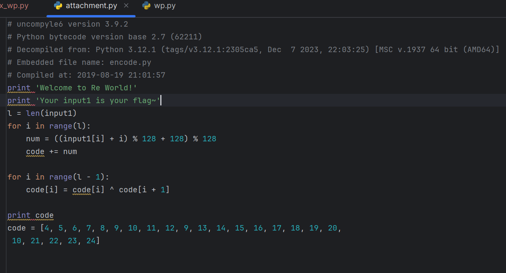

`uncompyle6`反编译`code`数据错了，一直得不到`flag`,以后得多用下其他方法,比如 在线pyc反编译, pycdc

上网搜的[buuctf pyre wp（附pyc反编译过程）](https://blog.csdn.net/m0_73749989/article/details/137893894?ops_request_misc=%257B%2522request%255Fid%2522%253A%25229B6651D7-C5F8-4A45-89F2-CD2E5329150D%2522%252C%2522scm%2522%253A%252220140713.130102334.pc%255Fall.%2522%257D&request_id=9B6651D7-C5F8-4A45-89F2-CD2E5329150D&biz_id=0&utm_medium=distribute.pc_search_result.none-task-blog-2~all~first_rank_ecpm_v1~rank_v31_ecpm-2-137893894-null-null.142^v100^pc_search_result_base6&utm_term=buuctf%20pyre%20%E5%8F%8D%E7%BC%96%E8%AF%91%E9%94%99%E4%BA%86&spm=1018.2226.3001.4187)
```python
#!/usr/bin/env python
# visit https://tool.lu/pyc/ for more information
# Version: Python 2.7

# print 'Welcome to Re World!'
# print 'Your input1 is your flag~'
# l = len(input1)
# for i in range(l):
#     num = ((input1[i] + i) % 128 + 128) % 128
#     code += num
#
# for i in range(l - 1):
#     code[i] = code[i] ^ code[i + 1]
#
# print code
code = [
    '\x1f', '\x12', '\x1d', '(', '0', '4', '\x01', '\x06', '\x14', '4', ',',
    '\x1b', 'U', '?', 'o', '6', '*', ':', '\x01', 'D', ';', '%', '\x13']

i = len(code)

# a^b^b = a
# 因为加密是当前字符与后一个字符的异或，也就意味着，最后一个字符
# 是没有发生异或的，要得到抑或前的字符就需要从倒数第二个字符开
# 始，从后往前，将当前字符与后一个字符异或

for j in range(i - 2, -1, -1):
    code[j] = chr(ord(code[j]) ^ ord(code[j + 1]))  # ord（）：将字符转换为Unicode编码
    # chr():将Unicode编码转换为字符
for k in range(i):
    code[k] = chr((ord(code[k]) - k) % 128)

s = ''.join(code)  # 将列表转换为字符串输出
print(f'{s}')

# 结果：GWHT{Just_Re_1s_Ha66y!}

```