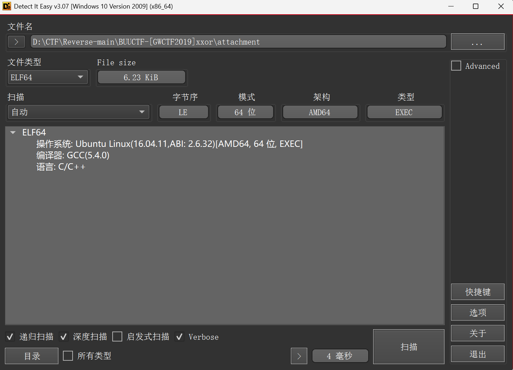

```c
__int64 __fastcall main(int a1, char **a2, char **a3)
{
  int i; // [rsp+8h] [rbp-68h]
  int j; // [rsp+Ch] [rbp-64h]
  __int64 v6[6]; // [rsp+10h] [rbp-60h] BYREF
  __int64 v7[6]; // [rsp+40h] [rbp-30h] BYREF

  v7[5] = __readfsqword(0x28u);
  puts("Let us play a game?");
  puts("you have six chances to input");
  puts("Come on!");
  memset(v6, 0, 40);
  for ( i = 0; i <= 5; ++i )
  {
    printf("%s", "input: ");
    __isoc99_scanf("%d", (char *)v6 + 4 * i);
  }
  memset(v7, 0, 40);
  for ( j = 0; j <= 2; ++j )
  {
    dword_601078 = v6[j];
    dword_60107C = HIDWORD(v6[j]);
    sub_400686(&dword_601078, &unk_601060);
    LODWORD(v7[j]) = dword_601078;
    HIDWORD(v7[j]) = dword_60107C;
  }
  if ( (unsigned int)sub_400770(v7) != 1 )
  {
    puts("NO NO NO~ ");
    exit(0);
  }
  puts("Congratulation!\n");
  puts("You seccess half\n");
  puts("Do not forget to change input to hex and combine~\n");
  puts("ByeBye");
  return 0LL;
}
```

```c
__int64 __fastcall sub_400770(_DWORD *a1)
{
  if ( a1[2] - a1[3] == 2225223423LL
    && a1[3] + a1[4] == 4201428739LL
    && a1[2] - a1[4] == 1121399208LL
    && *a1 == -548868226
    && a1[5] == -2064448480
    && a1[1] == 550153460 )
  {
    puts("good!");
    return 1LL;
  }
  else
  {
    puts("Wrong!");
    return 0LL;
  }
}
```

特别注意的是输入的是 ，`_DWORD`32位无符号

所以用z3时，最好先将等式后的数字转为十六进制

不然得到，是错的
```python
# [a1[0] = -548868226,
#  a1[2] = 3774025685,
#  a1[4] = 2652626477,
#  a1[3] = 1548802262,
#  a1[5] = -2064448480,
#  a1[1] = 550153460]
```
EXP:
```python
equations = [
    a1[2] - a1[3] == 0x84A236FF,
    a1[3] + a1[4] == 0xFA6CB703,
    a1[2] - a1[4] == 0x42D731A8,
    a1[0] == 0xDF48EF7E,
    a1[5] == 0x84F30420,
    a1[1] == 0x20CAACF4,
]
for q in equations:
    s.add(q)
# 判断是否有解
if s.check() == sat:
    r = s.model()
    print(r)
else:
    raise Exception("NO SOLUTION!")

# [a1[0] = 3746099070,
#  a1[2] = 3774025685,
#  a1[4] = 2652626477,
#  a1[3] = 1548802262,
#  a1[5] = 2230518816,
#  a1[1] = 550153460]
```
Exp:
```c
#include <iostream>
using namespace std;
 
int main() {
	int data[6] = { 3746099070,550153460,3774025685,1548802262,2652626477,2230518816 };
	unsigned int tmp1, tmp2;
	unsigned int v3, v4;
	int key[4] = { 2,2,3,4 };
	for (int i = 0; i < 5; i +=2) {
		v3 = data[i];
		v4 = data[i + 1];
		int v5 = 1166789954 * 64;
		for (int j = 0; j < 64; ++j)
		{
			 
			v4 -= (v3 + v5 + 20) ^ ((v3 << 6) + key[2]) ^ ((v3 >> 9) + key[3]) ^ 0x10;
			v3 -= (v4 + v5 + 11) ^ ((v4 << 6) + key[0]) ^ ((v4 >> 9) + key[1]) ^ 0x20;
			
			v5 -= 1166789954;
		}
 
		data[i] = v3;
		data[i + 1] = v4;
	}
	
	
	for (unsigned int i = 0; i < 6; i++)
		printf("%c%c%c", *((char*)&data[i] + 2), *((char*)&data[i] + 1), *(char*)&data[i]);
}
```
`flag{re_is_great!}`