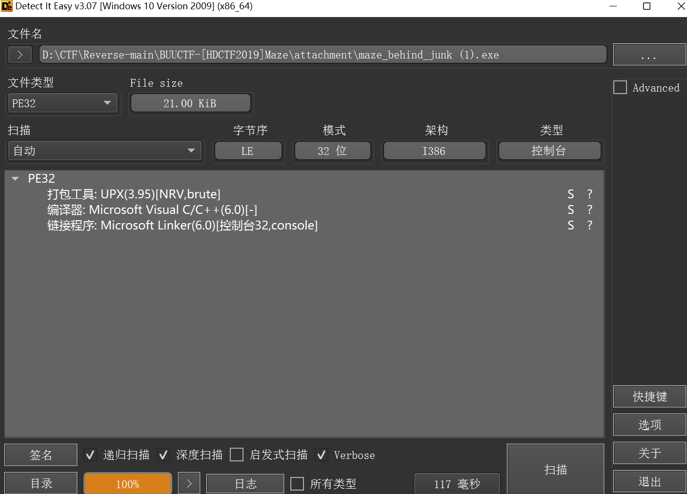
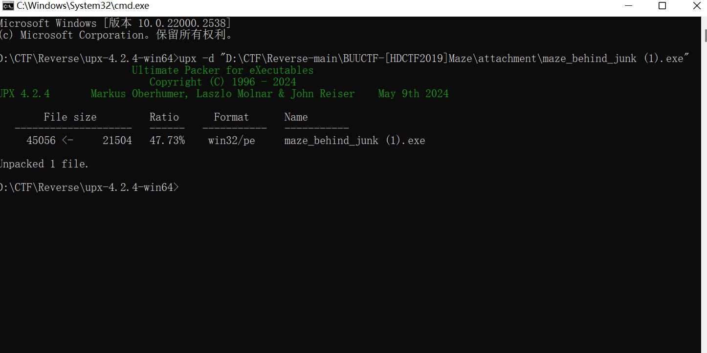
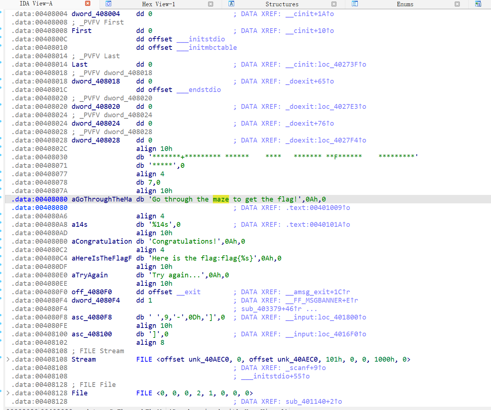
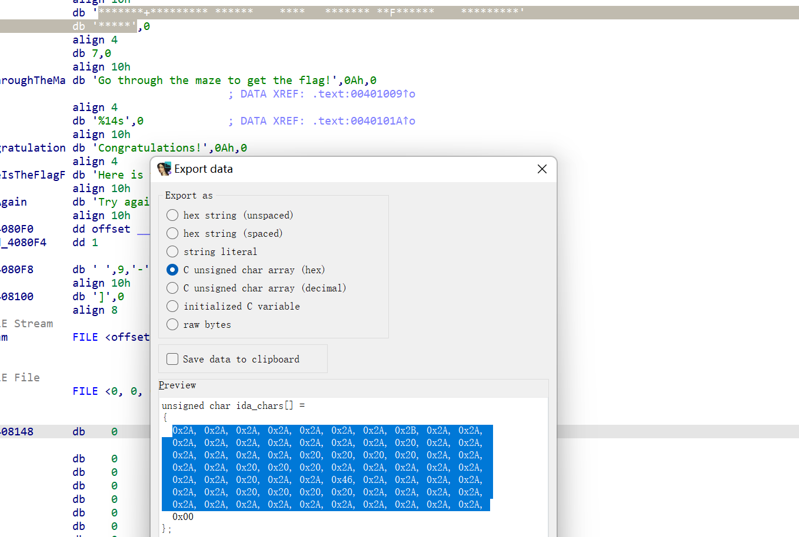
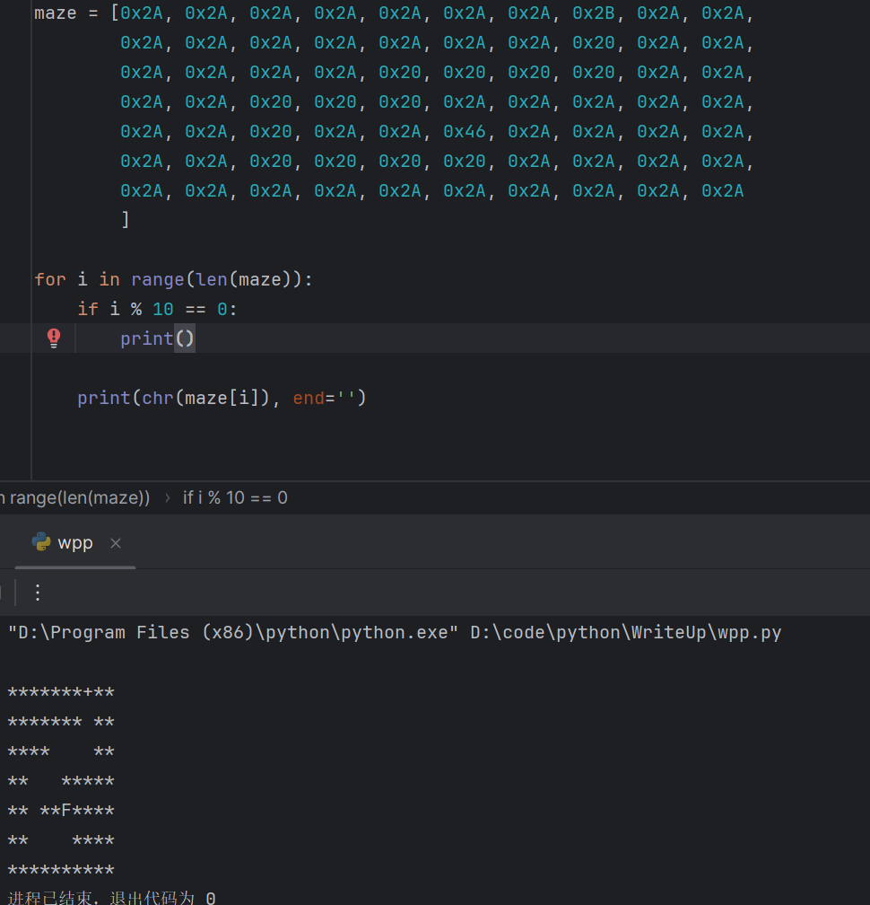

```python
maze = [0x2A, 0x2A, 0x2A, 0x2A, 0x2A, 0x2A, 0x2A, 0x2B, 0x2A, 0x2A,
        0x2A, 0x2A, 0x2A, 0x2A, 0x2A, 0x2A, 0x2A, 0x20, 0x2A, 0x2A,
        0x2A, 0x2A, 0x2A, 0x2A, 0x20, 0x20, 0x20, 0x20, 0x2A, 0x2A,
        0x2A, 0x2A, 0x20, 0x20, 0x20, 0x2A, 0x2A, 0x2A, 0x2A, 0x2A,
        0x2A, 0x2A, 0x20, 0x2A, 0x2A, 0x46, 0x2A, 0x2A, 0x2A, 0x2A,
        0x2A, 0x2A, 0x20, 0x20, 0x20, 0x20, 0x2A, 0x2A, 0x2A, 0x2A,
        0x2A, 0x2A, 0x2A, 0x2A, 0x2A, 0x2A, 0x2A, 0x2A, 0x2A, 0x2A
        ]

for i in range(len(maze)):
    if i % 10 == 0:
        print()

    print(chr(maze[i]), end='')

```


    可以直接看出来 ssaaasaassdddw
    flag{ssaaasaassdddw}

```python
# maze_str_to_list
maze_str = "*******+********* ******    ****   ******* **F******    **************"
index = 0

row = 7
col = 10
maze = []
for i in range(row):
    tmp = []
    for j in range(col):
        tmp.append(maze_str[index])
        index += 1
    maze.append(tmp)
print(maze)

```

```python
[['*', '*', '*', '*', '*', '*', '*', '+', '*', '*'], ['*', '*', '*', '*', '*', '*', '*', ' ', '*', '*'], ['*', '*', '*', '*', ' ', ' ', ' ', ' ', '*', '*'], ['*', '*', ' ', ' ', ' ', '*', '*', '*', '*', '*'], ['*', '*', ' ', '*', '*', 'F', '*', '*', '*', '*'], ['*', '*', ' ', ' ', ' ', ' ', '*', '*', '*', '*'], ['*', '*', '*', '*', '*', '*', '*', '*', '*', '*']]
```

```python
from collections import deque

maze = [['*', '*', '*', '*', '*', '*', '*', '+', '*', '*'],
        ['*', '*', '*', '*', '*', '*', '*', '0', '*', '*'],
        ['*', '*', '*', '*', '0', '0', '0', '0', '*', '*'],
        ['*', '*', '0', '0', '0', '*', '*', '*', '*', '*'],
        ['*', '*', '0', '*', '*', 'F', '*', '*', '*', '*'],
        ['*', '*', '0', '0', '0', '0', '*', '*', '*', '*'],
        ['*', '*', '*', '*', '*', '*', '*', '*', '*', '*']]


path_len = 0  # 如果题目没给出终点坐标，就会给路径长度，但记得 len = 题目给的len + 1


def bfs(start, end, barrier):
    # 方向：右、下、左、上
    directions = [(0, 1), (1, 0), (0, -1), (-1, 0)]
    
    start_pos = None
    end_pos = None
    
    # 查找起点和终点的坐标
    for i in range(len(maze)):
        for j in range(len(maze[i])):
            if maze[i][j] == start:  # 找到起点
                start_pos = (i, j)
            if maze[i][j] == end:  # 找到终点
                end_pos = (i, j)
    
    if not start_pos or not end_pos:
        print("起点或终点不存在")
        return None  # 如果起点或终点不存在，返回 None

    queue = deque()
    queue.append((start_pos, [start_pos]))  # (当前位置, 路径)
    visited = set()
    visited.add(start_pos)
    
    while queue:
        position, path = queue.popleft()
        
        if position == end_pos:
            return path
        
        # 遍历四个方向
        for d in directions:
            next_position = (position[0] + d[0], position[1] + d[1])
            
            if 0 <= next_position[0] < len(maze) and 0 <= next_position[1] < len(maze[0]) and \
                    maze[next_position[0]][next_position[1]] != barrier and next_position not in visited:
                queue.append((next_position, path + [next_position]))
                visited.add(next_position)
    
    return None  # 如果没有找到路径，返回 None


if __name__ == '__main__':
    maze[0][7] = '+'    # 手动添加起点, x位置
    maze[4][5] = 'F'    # 手动添加终点, x位置
    path = bfs('+', 'F', '*')   # 手动添加, (起点, 终点, 障碍物)
    
    if path is None:
        print("没有找到路径")
    else:
        print("移动路径坐标:", path)
        print("移动路径方位: ", end='')
        
        for i in range(1, len(path)):
            x1, y1 = path[i - 1]
            x2, y2 = path[i]
            if x1 > x2:
                print("w", end='')
            elif x1 < x2:
                print("s", end='')
            elif y1 > y2:
                print("a", end='')
            elif y1 < y2:
                print("d", end='')

# 移动路径坐标: [(0, 7), (1, 7), (2, 7), (2, 6), (2, 5), (2, 4), (3, 4), (3, 3), (3, 2), (4, 2), (5, 2), (5, 3), (5, 4), (5, 5), (4, 5)]
# 移动路径方位: ssaaasaassdddw
```