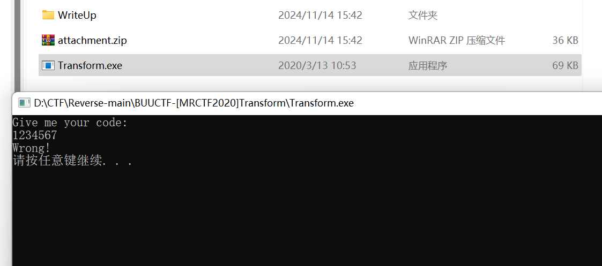
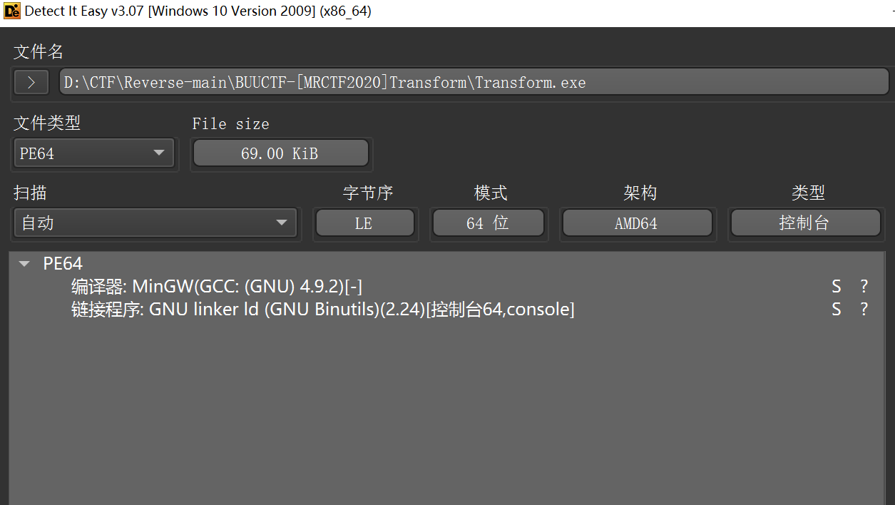
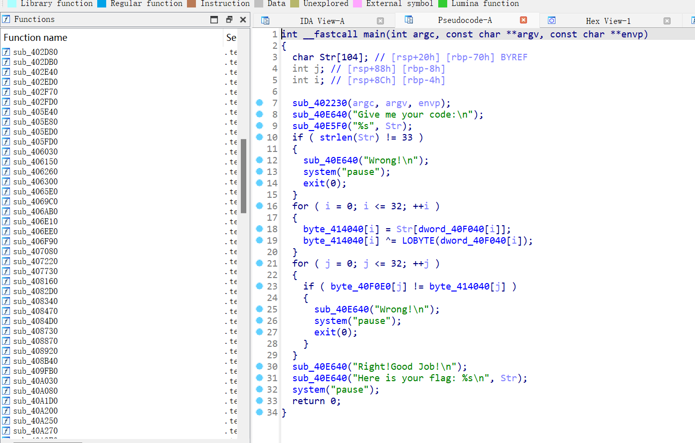

```c
对于 LOBYTE(9)，我们首先需要理解 LOBYTE 宏的作用：它提取一个 16 位数的低 8 位部分。

LOBYTE(w) 宏通常是这样定义的：

#define LOBYTE(w) ((unsigned char)(w & 0xFF))
分析
给定输入值 9：

9 的二进制表示是 0000 0000 0000 1001 (16 位的二进制表示)，在低字节中，我们看到它的低 8 位是 0000 1001，即 9。

执行 LOBYTE(9)：

9 的二进制表示 0000 1001，低 8 位是 0000 1001，它的值为 9。
结论
LOBYTE(9) 的结果是 9。
```

```python
data = [
    103, 121, 123, 127, 117, 43, 60, 82, 83, 121,
    87, 94, 93, 66, 123, 45, 42, 102, 66, 126,
    76, 87, 121, 65, 107, 126, 101, 60, 92, 69,
    111, 98, 77
]

index = [9, 10, 15, 23, 7, 24, 12, 6, 1, 16, 3, 17, 32, 29, 11, 30, 27,
         22, 4, 13, 19, 20, 21, 2, 25, 5, 31, 8, 18, 26, 28, 14, 0, ]
# print(len(data))
# print(len(index))
flag = [0] * 33
for i in range(len(data)):
    flag[index[i]] = chr(data[i] ^ index[i])
print(''.join(flag))
# MRCTF{Tr4nsp0sltiON_Clph3r_1s_3z}
```