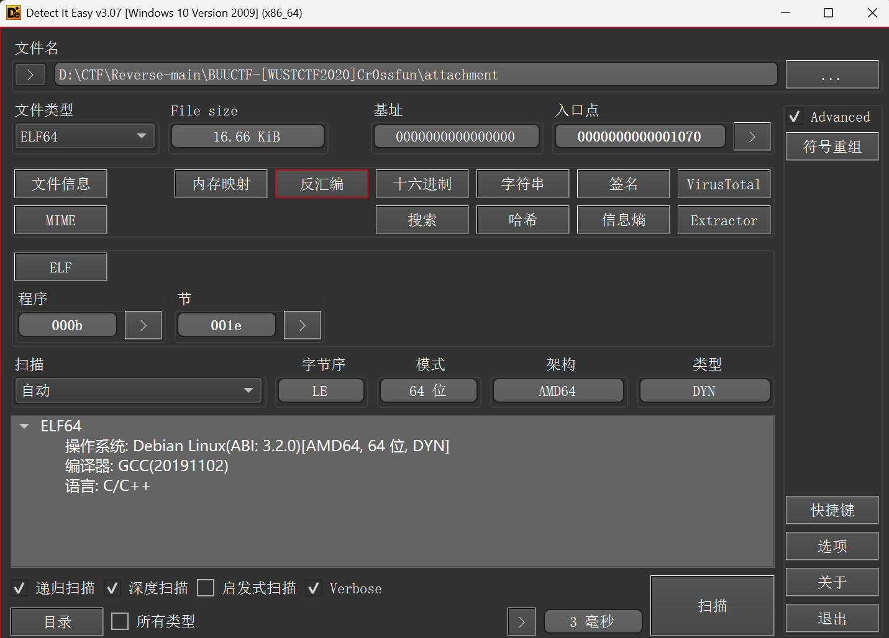
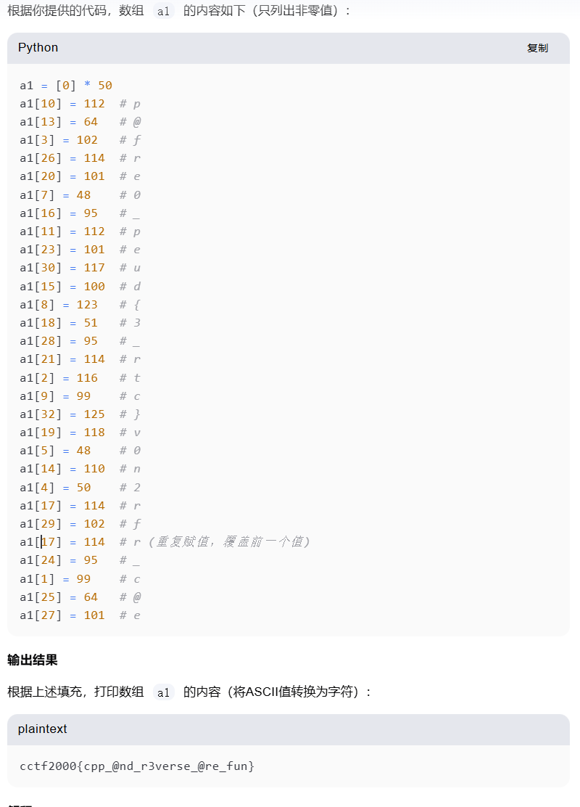

无聊的套娃拼接，直接让kimi帮我提取了
```c
_BOOL8 __fastcall iven_is_handsome(_BYTE *a1)
{
  return a1[10] == 112
      && a1[13] == 64
      && a1[3] == 102
      && a1[26] == 114
      && a1[20] == 101
      && (unsigned int)iven_is_c0ol(a1);
}

_BOOL8 __fastcall iven_is_c0ol(_BYTE *a1)
{
  return a1[7] == 48
      && a1[16] == 95
      && a1[11] == 112
      && a1[23] == 101
      && a1[30] == 117
      && (unsigned int)iven_1s_educated(a1);
}

_BOOL8 __fastcall iven_1s_educated(_BYTE *a1)
{
  return *a1 == 119 && a1[6] == 50 && a1[22] == 115 && a1[31] == 110 && a1[12] == 95 && (unsigned int)iven_1s_brave(a1);
}

_BOOL8 __fastcall iven_1s_brave(_BYTE *a1)
{
  return a1[15] == 100
      && a1[8] == 123
      && a1[18] == 51
      && a1[28] == 95
      && a1[21] == 114
      && (unsigned int)iven_1s_great(a1);
}

_BOOL8 __fastcall iven_1s_great(_BYTE *a1)
{
  return a1[2] == 116
      && a1[9] == 99
      && a1[32] == 125
      && a1[19] == 118
      && a1[5] == 48
      && a1[14] == 110
      && (unsigned int)iven_and_grace(a1);
}

_BOOL8 __fastcall iven_and_grace(_BYTE *a1)
{
  return a1[4] == 50 && a1[17] == 114 && a1[29] == 102 && a1[17] == 114 && a1[24] == 95 && (unsigned int)finally_fun(a1);
}

_BOOL8 __fastcall finally_fun(_BYTE *a1)
{
  return a1[1] == 99 && a1[25] == 64 && a1[27] == 101;
}

```

```c
a1[10] == 112
a1[13] == 64
a1[3] == 102
a1[26] == 114
a1[20] == 101
a1[7] == 48
a1[16] == 95
a1[11] == 112
a1[23] == 101
a1[30] == 117
a1[15] == 100
a1[8] == 123
a1[18] == 51
a1[28] == 95
a1[21] == 114
a1[2] == 116  
a1[9] == 99
a1[32] == 125
a1[19] == 118
a1[5] == 48
a1[14] == 110
a1[4] == 50 
a1[17] == 114 
a1[29] == 102 
a1[17] == 114 
a1[24] == 95
a1[1] == 99 
a1[25] == 64 
a1[27] == 101

```


最后用flag{}包裹
```
# cctf2000{cpp_@nd_r3verse_@re_fun}
# flag{cpp_@nd_r3verse_@re_fun}
```