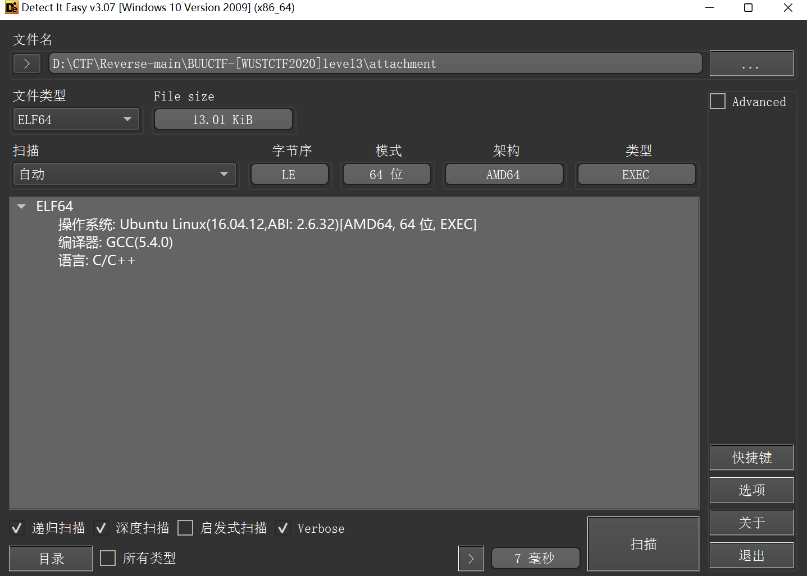
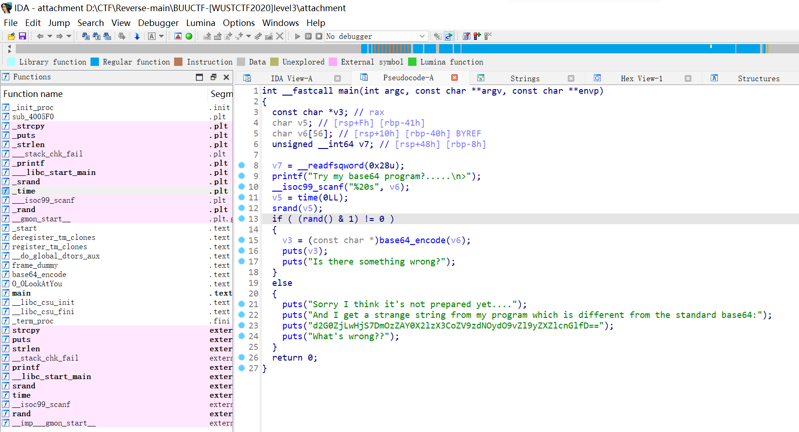
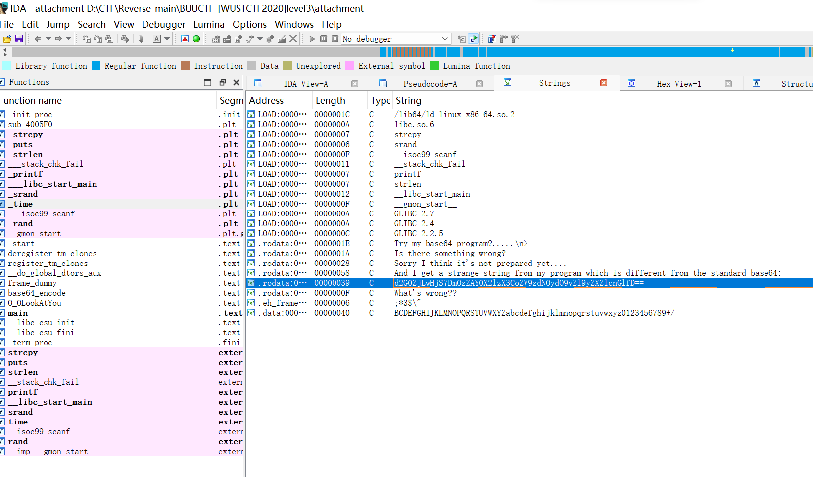
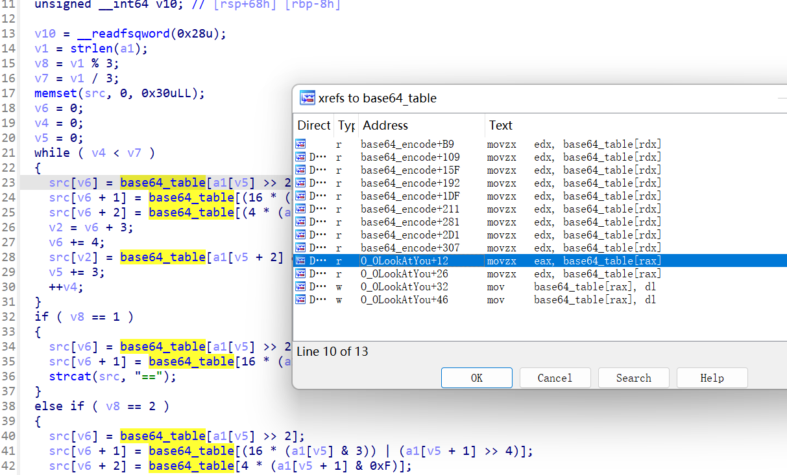
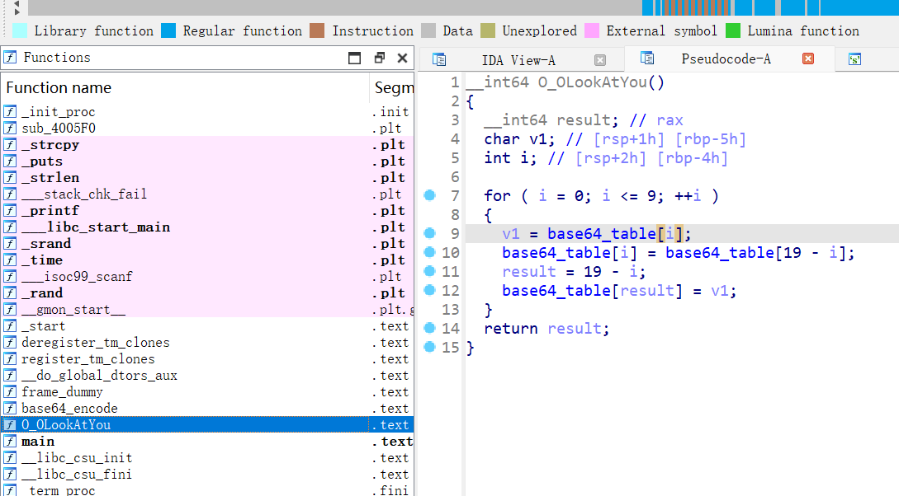

按 X 查看表的引用




```python
base64_table = [
    0x41, 0x42, 0x43, 0x44, 0x45, 0x46, 0x47, 0x48, 0x49, 0x4A,
    0x4B, 0x4C, 0x4D, 0x4E, 0x4F, 0x50, 0x51, 0x52, 0x53, 0x54,
    0x55, 0x56, 0x57, 0x58, 0x59, 0x5A, 0x61, 0x62, 0x63, 0x64,
    0x65, 0x66, 0x67, 0x68, 0x69, 0x6A, 0x6B, 0x6C, 0x6D, 0x6E,
    0x6F, 0x70, 0x71, 0x72, 0x73, 0x74, 0x75, 0x76, 0x77, 0x78,
    0x79, 0x7A, 0x30, 0x31, 0x32, 0x33, 0x34, 0x35, 0x36, 0x37,
    0x38, 0x39, 0x2B, 0x2F, 0x00
]

for i in range(0, 10):
    v1 = base64_table[i]
    base64_table[i] = base64_table[19 - i]
    result = 19 - i
    base64_table[result] = v1

for i in base64_table:
    print(''.join(chr(i)), end='')
```


```python
import base64
en_base64 = 'd2G0ZjLwHjS7DmOzZAY0X2lzX3CoZV9zdNOydO9vZl9yZXZlcnGlfD=='
de_base64 = ''
old_base64_table = 'ABCDEFGHIJKLMNOPQRSTUVWXYZabcdefghijklmnopqrstuvwxyz0123456789+/'
new_base64_table = 'TSRQPONMLKJIHGFEDCBAUVWXYZabcdefghijklmnopqrstuvwxyz0123456789+/'

print((base64.b64decode((en_base64.translate(str.maketrans(new_base64_table, old_base64_table))).encode())).decode())
# wctf2020{Base64_is_the_start_of_reverse}
```

```python
import base64 #导入base64模块用于解密
s1 = 'ABCDEFGHIJKLMNOPQRSTUVWXYZabcdefghijklmnopqrstuvwxyz0123456789+/' #标准表
s2 = 'qvEJAfHmUYjBac+u8Ph5n9Od17FrICL/X0gVtM4Qk6T2z3wNSsyoebilxWKGZpRD' #base64换表
en_text = '5Mc58bPHLiAx7J8ocJIlaVUxaJvMcoYMaoPMaOfg15c475tscHfM/8==' #密文
 
map = str.maketrans(s2, s1) #用str类中的maketrans建立映射，注意第一个参数是需要映射的字符串，第二个参数是映射的目标
map_text = en_text.translate(map) #映射实现替换密文，替换前是base64换表加密，替换后则是base64标准表加密
print(map_text) #可以先看看标准表加密的密文
print(base64.b64decode(map_text)) #直接使用提供的base64解密函数，获得明文，就是flag

# TlNTQ1RGe2E4ZDQzNDc3MjI4MDBlNzJlMzRlMWFiYTNmZTkxNGFlfQ==
# b'NSSCTF{a8d4347722800e72e34e1aba3fe914ae}'
```