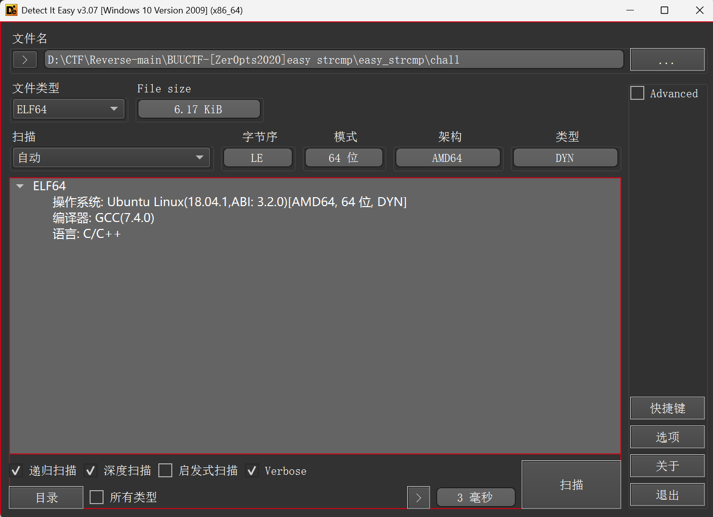
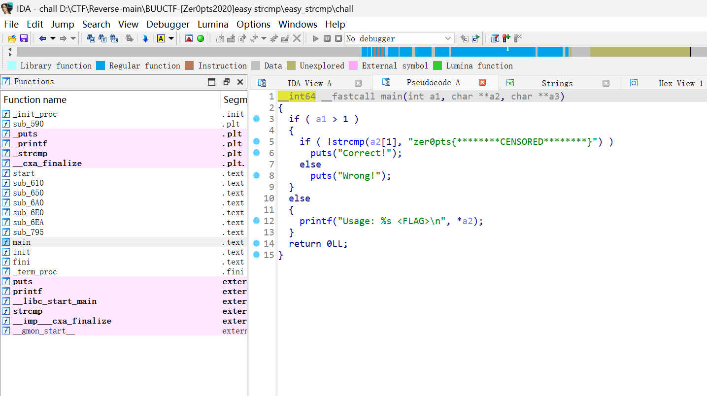
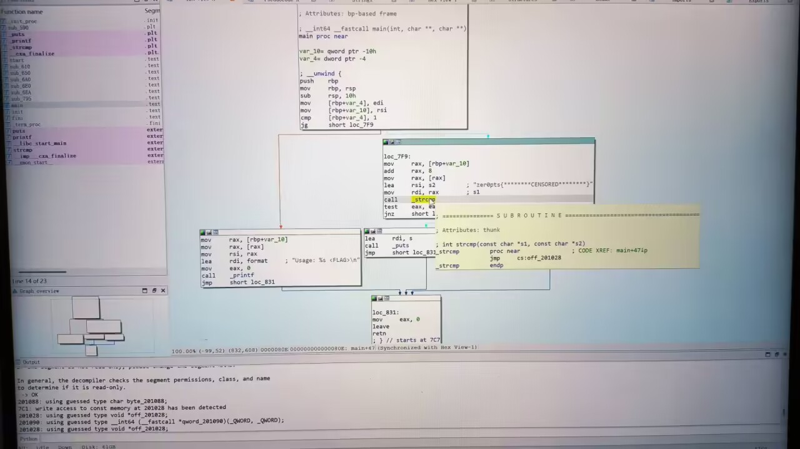
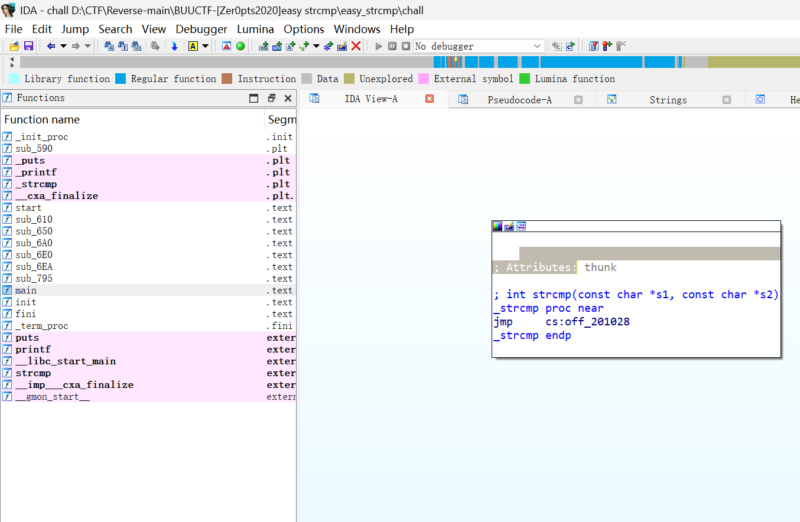
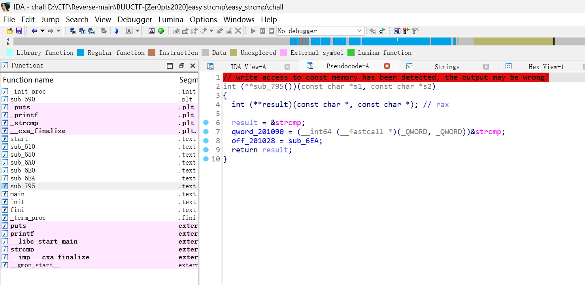
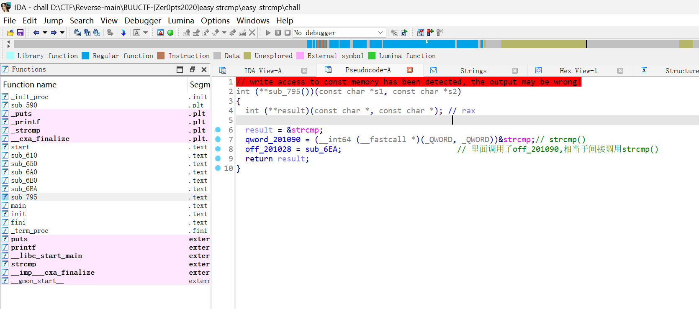
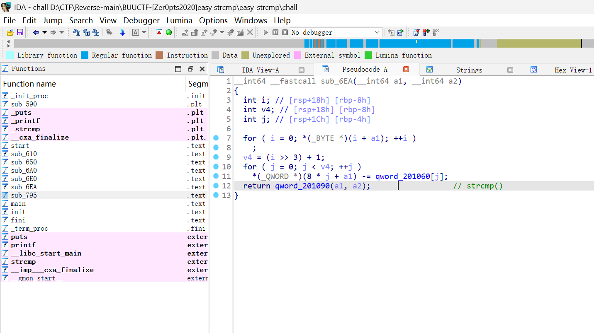
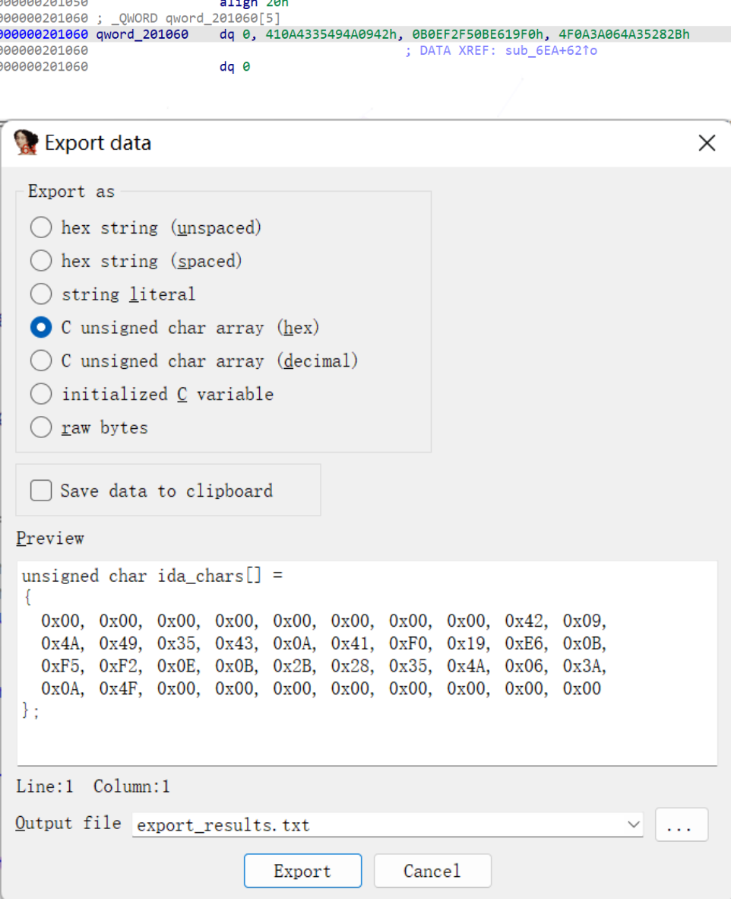
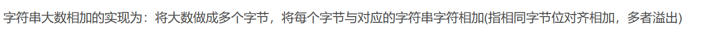
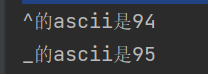

## 弄了好久，不会，看的别人的[题解1](https://www.cnblogs.com/Hznuxxw/p/16989358.html)，学习复现一下
## [题解2（更详细）](https://blog.csdn.net/2403_88000145/article/details/144201087?spm=1001.2101.3001.6650.2&utm_medium=distribute.pc_relevant.none-task-blog-2%7Edefault%7EYuanLiJiHua%7ECtr-2-144201087-blog-118148770.235%5Ev43%5Epc_blog_bottom_relevance_base1&depth_1-utm_source=distribute.pc_relevant.none-task-blog-2%7Edefault%7EYuanLiJiHua%7ECtr-2-144201087-blog-118148770.235%5Ev43%5Epc_blog_bottom_relevance_base1)



**直接看汇编，看到这的`strcmp`本质是跳转到`off_211028`**






小端序存储，不过shift+e提取自动识别提取

```python
data='zer0pts{********CENSORED********}'
data2=[0x00, 0x00, 0x00, 0x00, 0x00, 0x00, 0x00, 0x00, 0x42, 0x09,
  0x4A, 0x49, 0x35, 0x43, 0x0A, 0x41, 0xF0, 0x19, 0xE6, 0x0B,
  0xF5, 0xF2, 0x0E, 0x0B, 0x2B, 0x28, 0x35, 0x4A, 0x06, 0x3A,
  0x0A, 0x4F, 0x00, 0x00, 0x00, 0x00, 0x00, 0x00, 0x00, 0x00]
for i in range(len(data)):
    tem=ord(data[i])+data2[i]
    print(chr((tem)),end='')
```

```python
data='zer0pts{********CENSORED********}'
data2=[0x00, 0x00, 0x00, 0x00, 0x00, 0x00, 0x00, 0x00, 0x42, 0x09,
  0x4A, 0x49, 0x35, 0x43, 0x0A, 0x41, 0xF0, 0x19, 0xE6, 0x0B,
  0xF5, 0xF2, 0x0E, 0x0B, 0x2B, 0x28, 0x35, 0x4A, 0x06, 0x3A,
  0x0A, 0x4F, 0x00, 0x00, 0x00, 0x00, 0x00, 0x00, 0x00, 0x00]
for i in range(len(data)):
    tem=(ord(data[i])+data2[i])&0xff
    print(chr((tem)),end='')
```


上一字节溢出的给了下一位

exp1：
```python
data='zer0pts{********CENSORED********}'
data2=[0x00, 0x00, 0x00, 0x00, 0x00, 0x00, 0x00, 0x00, 0x42, 0x09,
  0x4A, 0x49, 0x35, 0x43, 0x0A, 0x41, 0xF0, 0x19, 0xE6, 0x0B,
  0xF5, 0xF2, 0x0E, 0x0B, 0x2B, 0x28, 0x35, 0x4A, 0x06, 0x3A,
  0x0A, 0x4F, 0x00]
f=0

for i in range(len(data)):
    if f!=0:
        tem = ord(data[i]) + data2[i]+f
        f=0
    else:
        tem=ord(data[i])+data2[i]
    if tem>0xff:
        f=1
    tem&=0xff
    print(chr((tem)),end='')

```

`zer0pts{l3ts_m4k3_4_DETOUR_t0d4y}`

exp2:

这里因为密钥的长度为64位所以不能用unsigned int（32位）来表示，不然会溢出
```c
#include <stdio.h>
#include<stdint.h>
#include<string.h>
int main() {
	char fake[] = { "zer0pts{********CENSORED********}" };
	unsigned char flag[50];
	uint64_t key[] = { 0LL, 4686632258374338882LL, 796841318371695088LL, 5695428477452625963LL, 0LL };
	for (int i = 0; i < strlen(fake) / 8; i++)
	{
		*(uint64_t*)&(fake[i * 8]) += key[i];
	}
	printf("%s", fake);
	return 0;
}
```