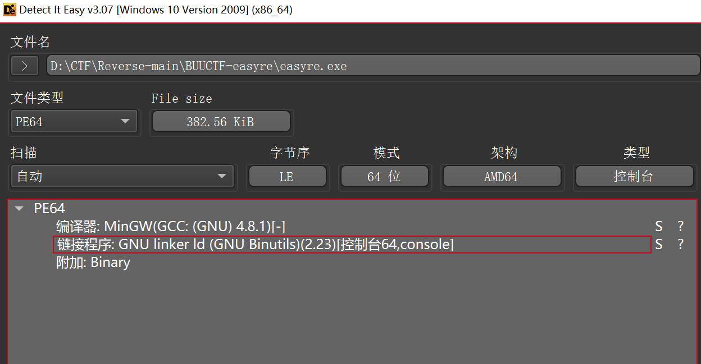
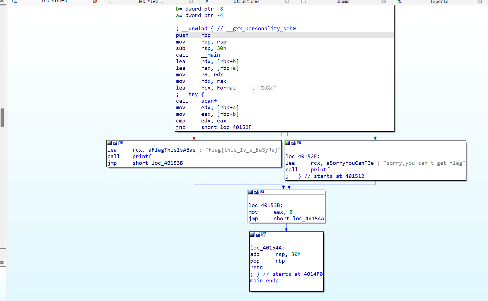
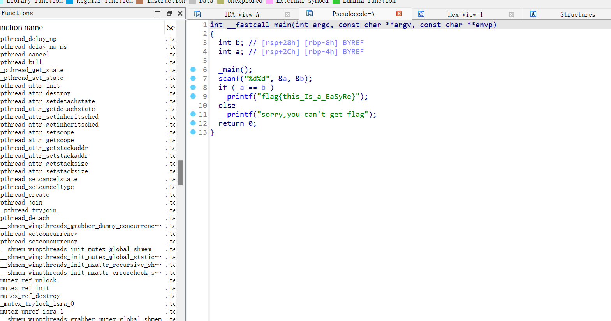

```python
v4 = "*F'\"N,\"(I?+@"
__data_start__ = [
    126, 125, 124, 123, 122, 121, 120, 119, 118, 117,
    116, 115, 114, 113, 112, 111, 110, 109, 108, 107,
    106, 105, 104, 103, 102, 101, 100, 99, 98, 97,
    96, 95, 94, 93, 92, 91, 90, 89, 88, 87,
    86, 85, 84, 83, 82, 81, 80, 79, 78, 77,
    76, 75, 74, 73, 72, 71, 70, 69, 68, 67,
    66, 65, 64, 63, 62, 61, 60, 59, 58, 57,
    56, 55, 54, 53, 52, 51, 50, 49, 48, 47,
    46, 45, 44, 43, 42, 41, 40, 39, 38, 37,
    36, 35, 32, 33, 34, 0
]

for i in range(len(v4)):
    for j in range(len(__data_start__)):
        if v4[i] == chr(__data_start__[j]):
            print(chr(j + 1), end='')
            
```