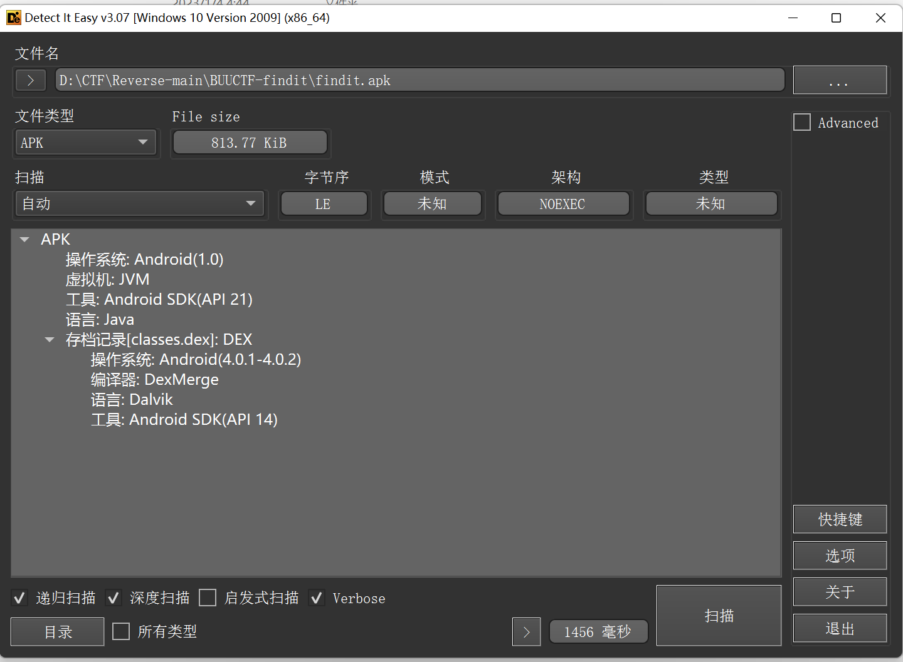
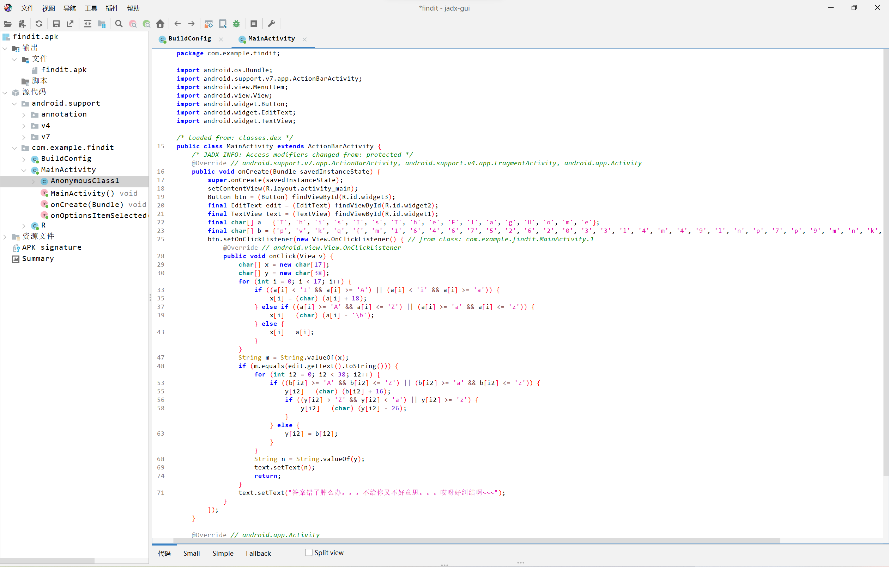

```python
flag = [
    'p', 'v', 'k', 'q', '{', 'm', '1', '6', '4', '6', '7', '5', '2', '6', '2', '0', '3', '3', 'l', '4', 'm', '4', '9',
    'l', 'n', 'p', '7', 'p', '9', 'm', 'n', 'k', '2', '8', 'k', '7', '5', '}']
print(''.join(flag))
# pvkq{m164675262033l4m49lnp7p9mnk28k75}
# 凯撒解密 偏移量为 10
# flag{c164675262033b4c49bdf7f9cda28a75}
```