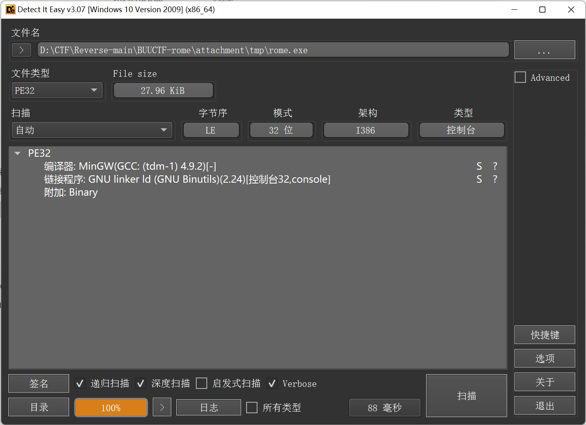
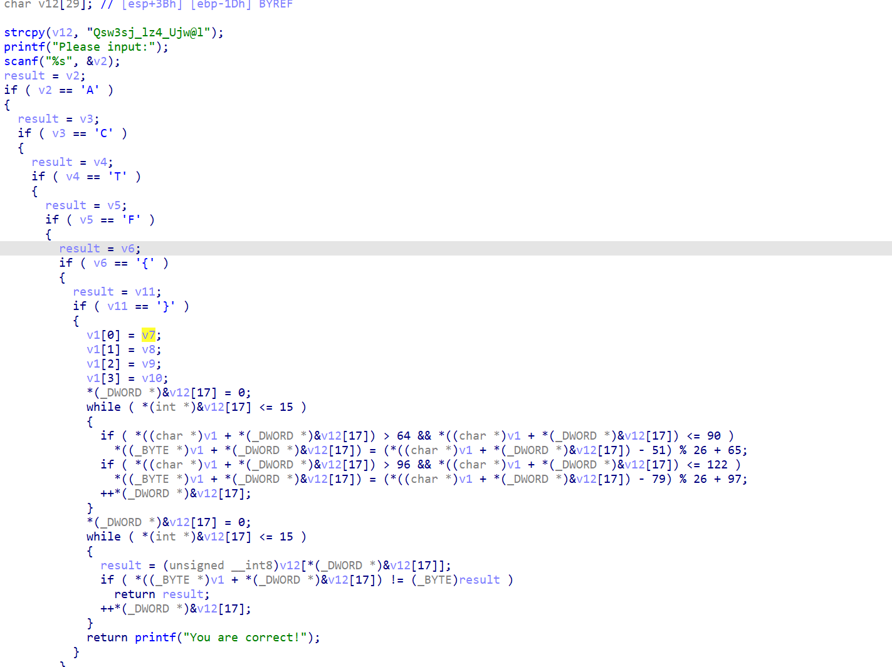

```python
key="Qsw3sj_lz4_Ujw@l"
flag=""
 
for c in key:
    if c>='a' and c<='z':
        flag+=chr((ord(c)-18-97)%26+97) 
    elif c>='A' and c<='Z':
        flag+=chr((ord(c)-14-65)%26+65)
    else:
        flag+=c
 
print(flag)
 
##原始数据加减移位值，-97或者是-65然后%26变为索引值，再加上97或者是65变为asiic码

```

```python
str1 = [81, 115, 119, 51, 115, 106, 95, 108, 122, 52, 95, 85, 106, 119, 64, 108]
flag = ""
str2 = "abcdefghijklmnopqrstuvwxyz"
str3 = str2.upper()

for i in str1:
    if 64 < i <= 90:
        flag += str3[i - 14 - 65]
    elif 96 < i <= 122:
        flag += str2[i - 18 - 97]
    else:
        flag += chr(i)
print('flag{' + flag + '}')

```