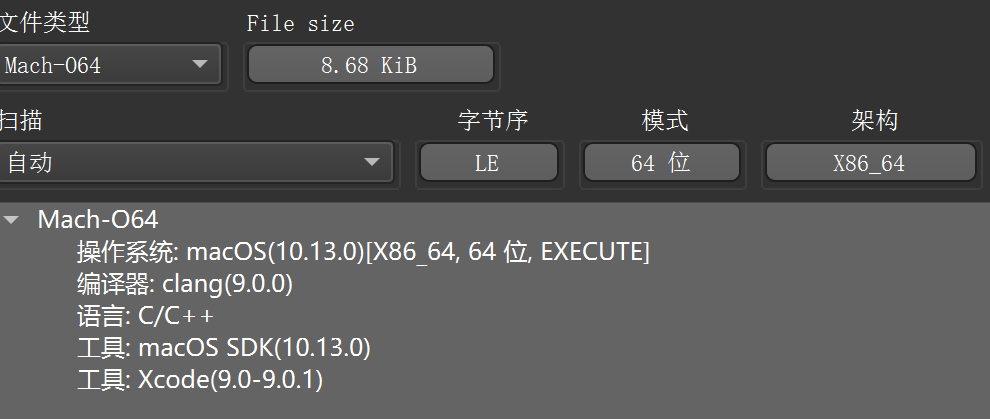
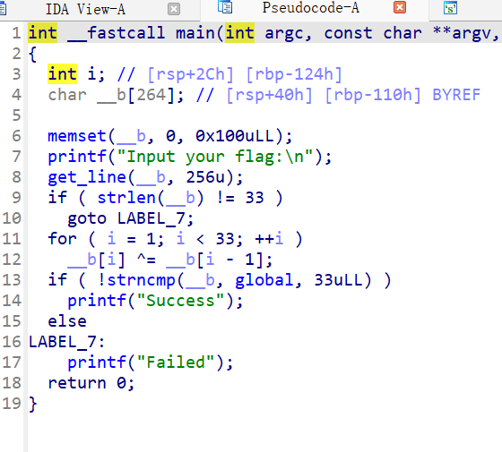
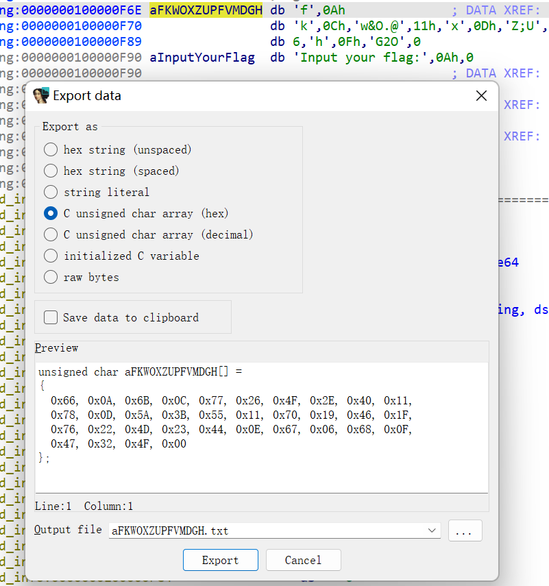

# BUUCTF xor
1.用DetectItEasy检查xor, 无壳, X86_64为64位, EXECUTE(可执行)为exe程序
    


2.按Tab查看伪代码
`__b[i] ^= __b[i - 1];`,发现进行异或操作(xor)
```c
int __fastcall main(int argc, const char **argv, const char **envp)
{
  int i; // [rsp+2Ch] [rbp-124h]
  char __b[264]; // [rsp+40h] [rbp-110h] BYREF

  memset(__b, 0, 0x100uLL);
  printf("Input your flag:\n");
  get_line(__b, 256u);
  if ( strlen(__b) != 33 )
    goto LABEL_7;
  for ( i = 1; i < 33; ++i )
    __b[i] ^= __b[i - 1];
  if ( !strncmp(__b, global, 33uLL) ) //33 处理过, 为十进制, 原本为0x21, 十六进制
    printf("Success");
  else
LABEL_7:
    printf("Failed");
  return 0;
```


3.分析伪代码,追踪并提取(shift + E)`global`的值,编写python脚本



```python
list = [
    0x66, 0x0A, 0x6B, 0x0C, 0x77, 0x26, 0x4F, 0x2E, 0x40, 0x11, 
    0x78, 0x0D, 0x5A, 0x3B, 0x55, 0x11, 0x70, 0x19, 0x46, 0x1F, 
    0x76, 0x22, 0x4D, 0x23, 0x44, 0x0E, 0x67, 0x06, 0x68, 0x0F, 
    0x47, 0x32, 0x4F, 0x00]

# flag{xxxxxx}
flag=chr(list[0])
# 从第i位开始，与i-1异或, i>=1
i = 1
while True:
  if i < len(list):
    flag += chr(list[i] ^ list[i - 1])  
    i += 1
  else:
    break
print(flag)
# flag{QianQiuWanDai_YiTongJiangHu}O
```