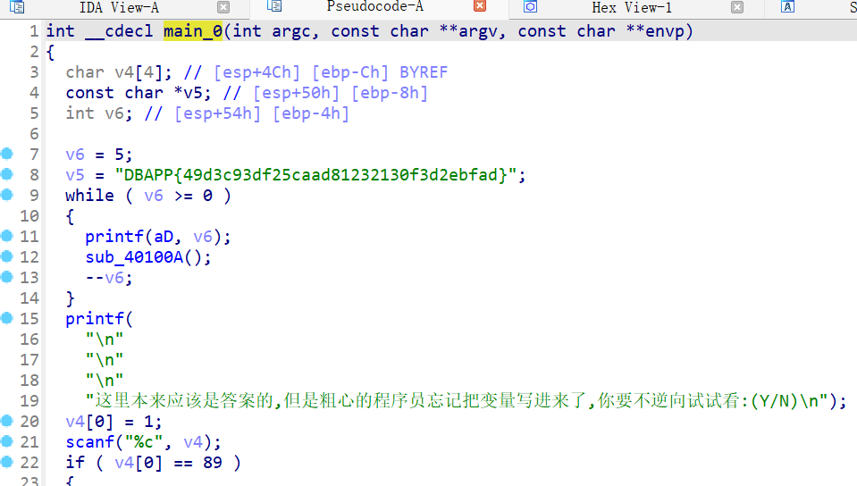

# BUUCTF 内涵的软件
    首先,程序名太长了，改为1.exe

    然后，用exeinfo,发现无壳，且为32位

    放进 ida 中，ctrl + f 查找 main 函数

    进入 _main_0，按Tab查看伪代码

    开始以为 DBAPP{49d3c93df25caad81232130f3d2ebfad}并不是flag

    刚开始以为还有什么操作，随便跟踪了几个函数后没什么发现

    就直接提交了，就是了flag,单纯题目名称内涵一下
    
    flag{49d3c93df25caad81232130f3d2ebfad}
