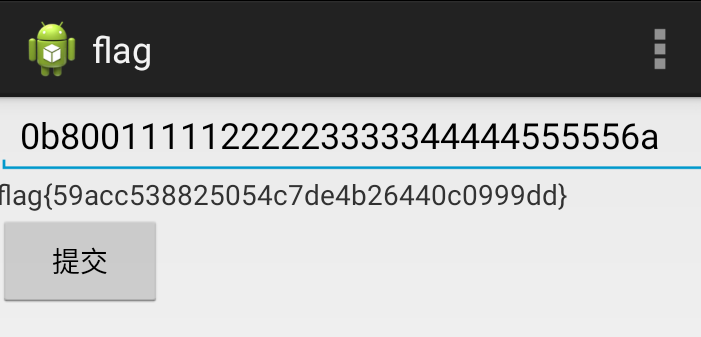

# BUUCTF 简单注册器

我做的第一个apk的题,这对我来说一点不简单,光是下载apk相关的反编译工具就挺麻烦的了,
这份wp也是我边学边做的历程

    先无脑放进Delete It Easy中,无壳,语言java

先去搜一下需要的工具：

    1.d2j-dex2jar_2.0
    将dex文件转为jar文件, 2音译to
    作用:将apk反编译成Java源码(classes.dex转化成jar文件)

    2.jd-gui
    用来打开jar包(反编译)
    作用:查看APK中classes.dex转化成出的jar文件,即源码文件

    3.apktool.jar

    4.jadx
    这里很坑,因为我是之后才去用jadx的,
    jadx必须要运行在java8 64位的jdk上
    发现jadx比前面的简单多了
    直接把apk放进去就反编译好了

1.开始,上网搜索发现apk实际上是一种压缩包,将.apk文件修改后缀为.zip文件,

解压后可以看到以下目录：（文件夹 “源码” 除外）

[APK解压后文件说明](https://blog.csdn.net/xiangxiang_8_8/article/details/115527888?ops_request_misc=%257B%2522request%255Fid%2522%253A%2522465928EF-8138-4660-B1C9-02ED8FF130F6%2522%252C%2522scm%2522%253A%252220140713.130102334..%2522%257D&request_id=465928EF-8138-4660-B1C9-02ED8FF130F6&biz_id=0&utm_medium=distribute.pc_search_result.none-task-blog-2~all~sobaiduend~default-2-115527888-null-null.142^v100^pc_search_result_base6&utm_term=apk%E8%A7%A3%E5%8E%8B&spm=1018.2226.3001.4187)

2.然后,用d2j-dex2jar将`classes.dex`转为`jar`包
    
    先把`classes.dex`放到`d2j-dex2jar`目录下,在当前目录下打开cmd,
    输入`d2j-dex2jar.bat classes.dex`,就会生成`classes-dex2jar.jar`

    接着,用jd-gui打开刚生成的jar包,就可看到源代码了

    分析代码, 其实就是str1 即 
    arrayOfChar[0] = '0'
    arrayOfChar[-1] = 'a'
    arrayOfChar[1] = 'b'
    arrayOfChar[2] = '8' // 因为要str(a[0] + a[2])等于对应的48 + 58,0和8的ascii码对应48和56

    所以构造注册码 0b80011111222223333344444555556a

