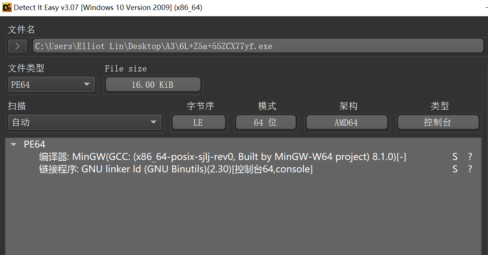

**6L+Z5a+55ZCX77yf**

```c
int __fastcall main(int argc, const char **argv, const char **envp)
{
  unsigned __int8 *v3; // rax
  unsigned __int8 *v4; // rbx
  unsigned __int8 *v5; // rdx
  char *v6; // rax
  char v8[80]; // [rsp+20h] [rbp-158h] BYREF
  char v9[264]; // [rsp+70h] [rbp-108h] BYREF

  sub_401800(argc, argv, envp);
  strcpy(v8, "ZKj9n+yf0wDVX1s/5YbdxSo=ILaUpPBCHg8uvNO4klm6iJGhQ7eFrWczAMEq3RTt2");
  sub_401550(v8, 0i64, 64i64);
  puts("plz input the flag:");
  scanf("%s", v9);
  v3 = (unsigned __int8 *)sub_401640(v9, v8);
  v4 = v3;
  if ( *v3 == 77 )
  {
    v5 = v3 + 1;
    v6 = "ZkUMqg7O2Y7FJk7FHY7FJkfO4kfFHY7O4kfFHYw";
    while ( *v5 == *v6 )
    {
      ++v6;
      ++v5;
      if ( "" == v6 )
      {
        puts("correct");
        free(v4);
        return 0;
      }
    }
  }
  puts("wrong");
  free(v4);
  return 0;
}
```