# 真正的签到

先用`Exeinfo`查壳: 无壳，64位，go语言

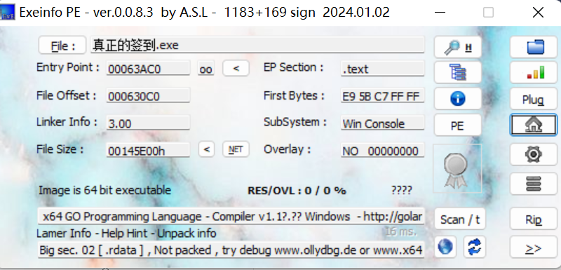

用`IDA64`打开，找到main函数，直接就有flag

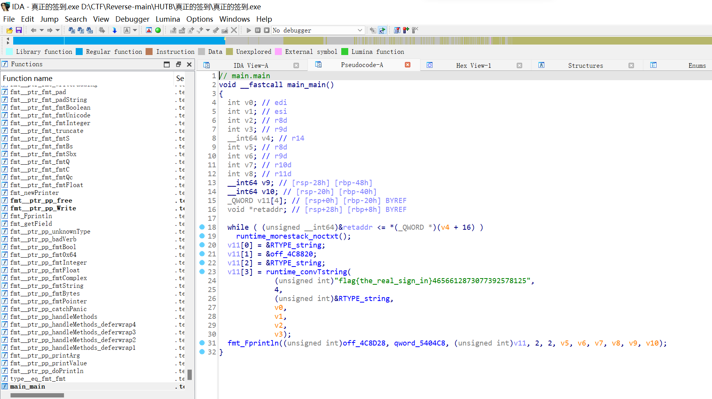

    flag{the_real_sign_in}

---

# 点击签到
看到`jar`包，先用java关联`jar`包运行一下

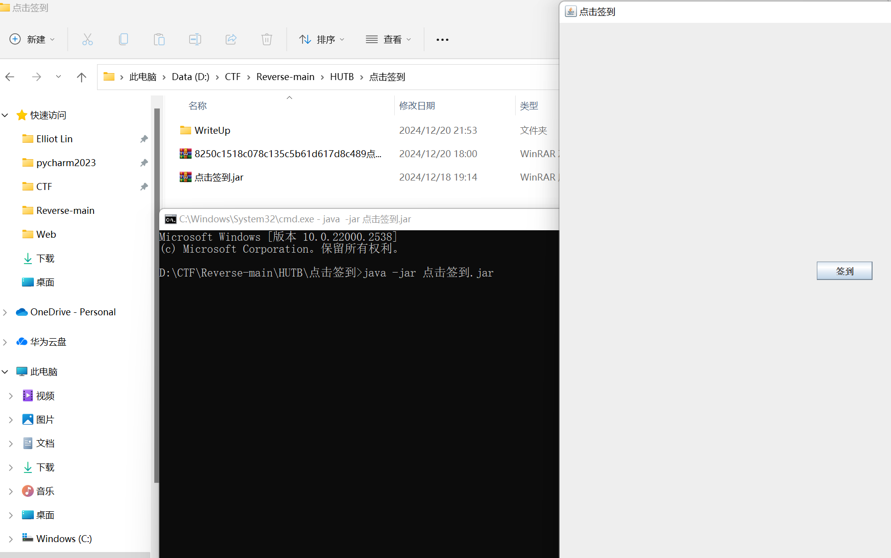

但是`签到`按钮是按不到的，会闪现

于是先用`die`查壳，无壳

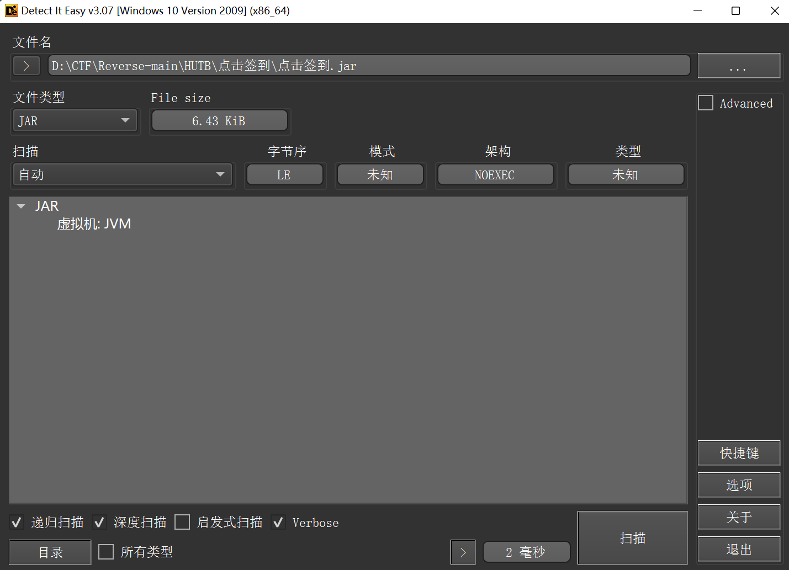

然后用`jadx-gui`反编译，找到主函数

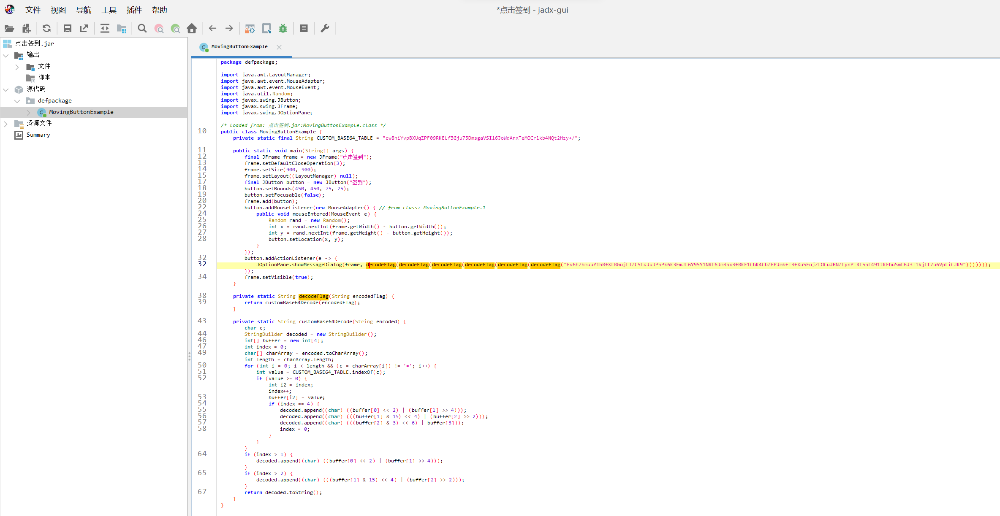

发现是`base64换表`，而且还加密了6次

    base64表：
    cw8hiYvpBXUqZPF09RKELf3Gju75DmsgaVSI16JoWdAnxTeMOCrlkb4NQt2Hzy+/

    加密6次后：
    Ev6h7hmuuY1bRfXLRGujLlZC5LdJuJPnPk6K3EmJL6Y95Y1NRL6Jm3bx3fRKE1ChK4CbZEPJmbfT3fXu5EujZLOCuJBNZLynPlRL5pL491tKEhuSmL6J3I1kjLt7u6VpLiCJK9

用`Cyberchef`，解密得flag

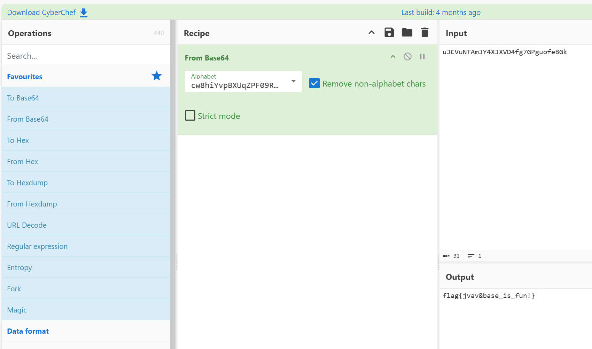

    flag{jvav&base_is_fun!}

---
# lc¿

**提示**：不记得了，但是说是python

一开始单纯的，把exe改成pyc,想着直接用`pycdc`反编译,后面一直错误，反编译不了

仔细一看才发现用了`Pylnstaller`打包

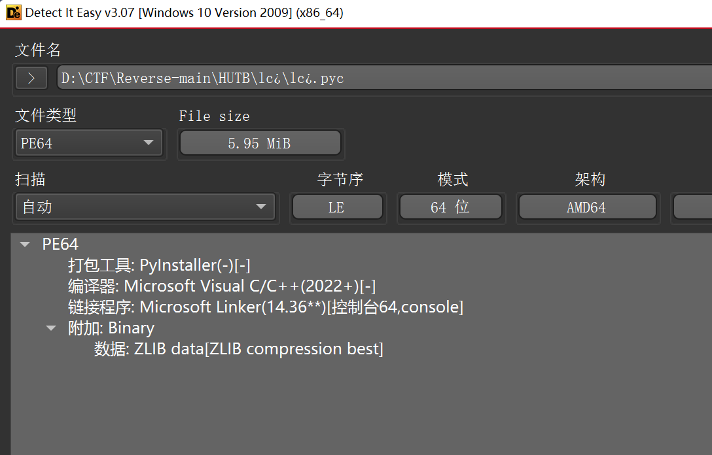

用 `pyinstxtractor.py`解包，生成`lc.exe_extracted文件夹`

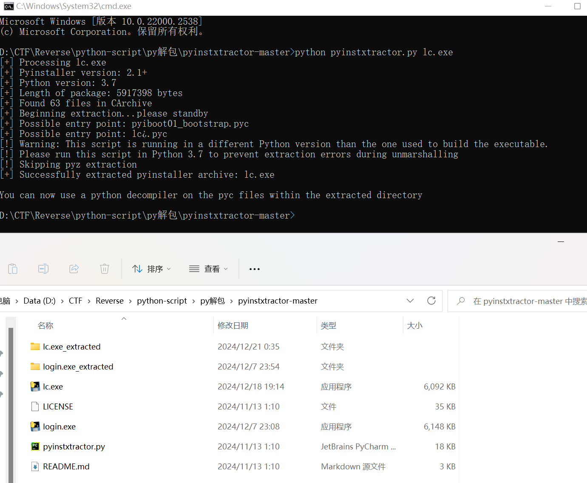

在`lc.exe_extracted文件夹`里找到`lc.pyc`

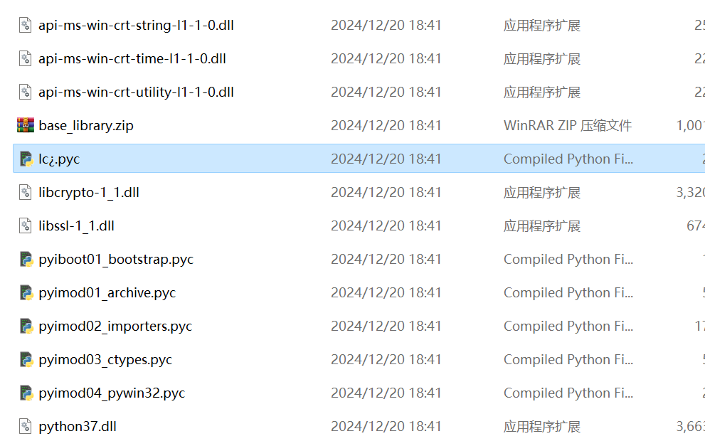

最后用`pycdc`反编译pyc,得到python代码

```python

def hint():
    print('Rsa')
    print('p和q很接近哦')

if __name__ == '__main__':
    print('n = 15141582763421955819254042147102544402368611742163888781765090083495737010892390414303206064971161690095468260109214755318435715386176702148980805904090506865492166099401096549413662995352421162616362667688050697793935642524692291920882509405326808357774194400233366840002585364761867159729058684495612222286236941862125409088353147041225896774692317241635988687686984697517087249953776324748416170514112457033321357162980313700729726283770887460718911672305354026660330700026144986633486940465091995123206766154783991421130392358786161921492288513277235549488643161621013974849758920117109758764420854228779898068317')
    print('c = 6178794643928434161739023306889397128020055578901057529700316058628342851885977403791448078574467838288523916429344303326078038848002921401552993686889221564098956114266351855477883811949348025720803684248490538759347329129586056855532398805475057787263565468485191683410525901052001664245705489501950325712240324062464375844368316659295307790261521421794497716995172958815179469763773749235296463574314188092917099601498766594888786507650382177250721267039714845175713645526980838122727273411814162789459072852328640597548883993448105141213457020252705294875782114742559941965078906839563983823333479934985791051343')
```

卡了很久，最后用了以前做西电题的脚本

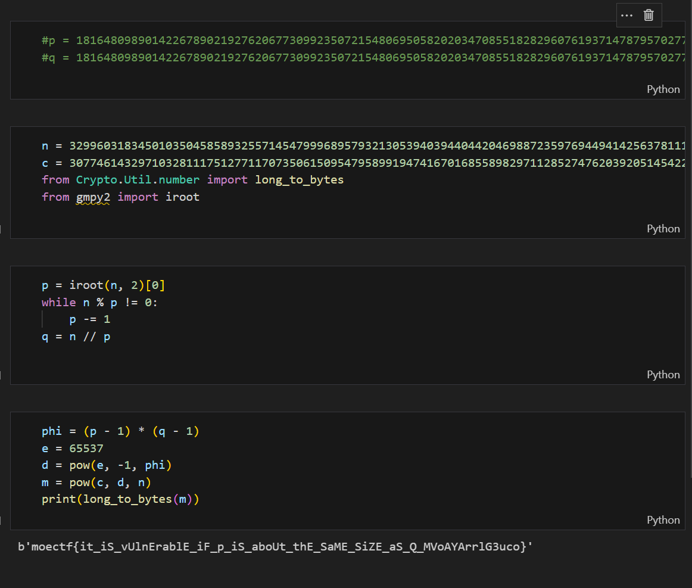

因为`p`和`q`相差很小，于是先想到开根号

`e`没给， 于是默认是`65537`了

```python
from Crypto.Util.number import long_to_bytes
from gmpy2 import iroot

n = 15141582763421955819254042147102544402368611742163888781765090083495737010892390414303206064971161690095468260109214755318435715386176702148980805904090506865492166099401096549413662995352421162616362667688050697793935642524692291920882509405326808357774194400233366840002585364761867159729058684495612222286236941862125409088353147041225896774692317241635988687686984697517087249953776324748416170514112457033321357162980313700729726283770887460718911672305354026660330700026144986633486940465091995123206766154783991421130392358786161921492288513277235549488643161621013974849758920117109758764420854228779898068317
c = 6178794643928434161739023306889397128020055578901057529700316058628342851885977403791448078574467838288523916429344303326078038848002921401552993686889221564098956114266351855477883811949348025720803684248490538759347329129586056855532398805475057787263565468485191683410525901052001664245705489501950325712240324062464375844368316659295307790261521421794497716995172958815179469763773749235296463574314188092917099601498766594888786507650382177250721267039714845175713645526980838122727273411814162789459072852328640597548883993448105141213457020252705294875782114742559941965078906839563983823333479934985791051343

p = iroot(n, 2)[0]
while n % p != 0:
    p -= 1
q = n // p

phi = (p - 1) * (q - 1)
e = 65537
d = pow(e, -1, phi)
m = pow(c, d, n)
print(long_to_bytes(m))

# b'flag{lc_is_a_handsome_boy}'
```

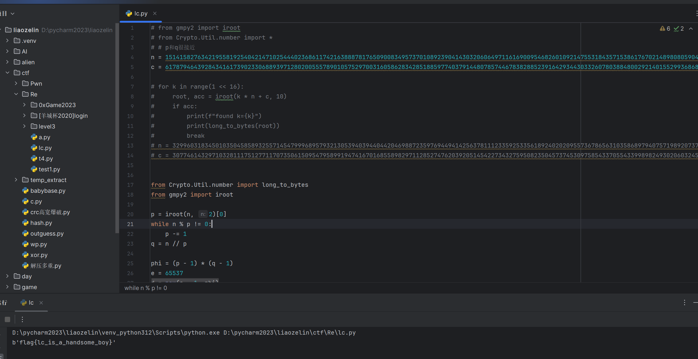

