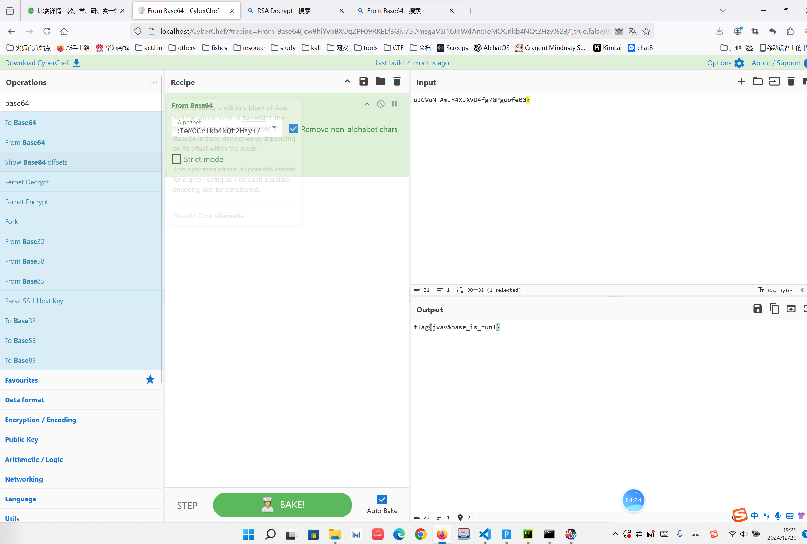
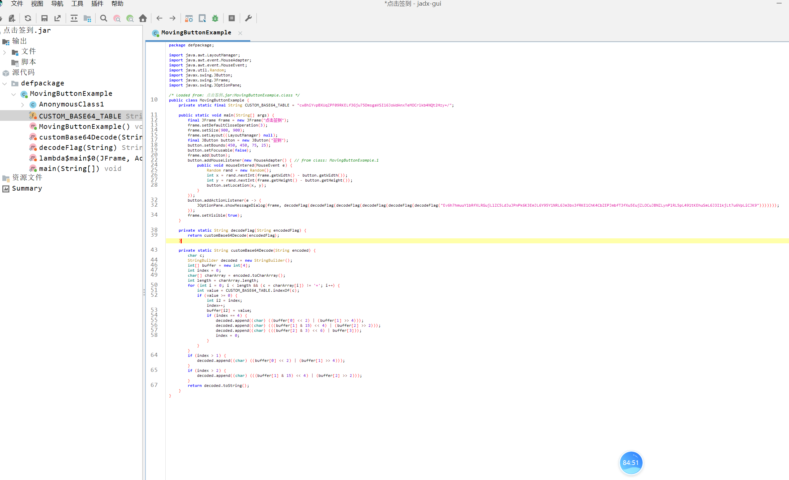

base64换表
```java
package defpackage;

import java.awt.LayoutManager;
import java.awt.event.MouseAdapter;
import java.awt.event.MouseEvent;
import java.util.Random;
import javax.swing.JButton;
import javax.swing.JFrame;
import javax.swing.JOptionPane;

/* loaded from: 点击签到.jar:MovingButtonExample.class */
public class MovingButtonExample {
    private static final String CUSTOM_BASE64_TABLE = "cw8hiYvpBXUqZPF09RKELf3Gju75DmsgaVSI16JoWdAnxTeMOCrlkb4NQt2Hzy+/";

    public static void main(String[] args) {
        final JFrame frame = new JFrame("点击签到");
        frame.setDefaultCloseOperation(3);
        frame.setSize(900, 900);
        frame.setLayout((LayoutManager) null);
        final JButton button = new JButton("签到");
        button.setBounds(450, 450, 75, 25);
        button.setFocusable(false);
        frame.add(button);
        button.addMouseListener(new MouseAdapter() { // from class: MovingButtonExample.1
            public void mouseEntered(MouseEvent e) {
                Random rand = new Random();
                int x = rand.nextInt(frame.getWidth() - button.getWidth());
                int y = rand.nextInt(frame.getHeight() - button.getHeight());
                button.setLocation(x, y);
            }
        });
        button.addActionListener(e -> {
            JOptionPane.showMessageDialog(frame, decodeFlag(decodeFlag(decodeFlag(decodeFlag(decodeFlag(decodeFlag("Ev6h7hmuuY1bRfXLRGujLlZC5LdJuJPnPk6K3EmJL6Y95Y1NRL6Jm3bx3fRKE1ChK4CbZEPJmbfT3fXu5EujZLOCuJBNZLynPlRL5pL491tKEhuSmL6J3I1kjLt7u6VpLiCJK9")))))));
        });
        frame.setVisible(true);
    }

    private static String decodeFlag(String encodedFlag) {
        return customBase64Decode(encodedFlag);
    }

    private static String customBase64Decode(String encoded) {
        char c;
        StringBuilder decoded = new StringBuilder();
        int[] buffer = new int[4];
        int index = 0;
        char[] charArray = encoded.toCharArray();
        int length = charArray.length;
        for (int i = 0; i < length && (c = charArray[i]) != '='; i++) {
            int value = CUSTOM_BASE64_TABLE.indexOf(c);
            if (value >= 0) {
                int i2 = index;
                index++;
                buffer[i2] = value;
                if (index == 4) {
                    decoded.append((char) ((buffer[0] << 2) | (buffer[1] >> 4)));
                    decoded.append((char) (((buffer[1] & 15) << 4) | (buffer[2] >> 2)));
                    decoded.append((char) (((buffer[2] & 3) << 6) | buffer[3]));
                    index = 0;
                }
            }
        }
        if (index > 1) {
            decoded.append((char) ((buffer[0] << 2) | (buffer[1] >> 4)));
        }
        if (index > 2) {
            decoded.append((char) (((buffer[1] & 15) << 4) | (buffer[2] >> 2)));
        }
        return decoded.toString();
    }
}
```