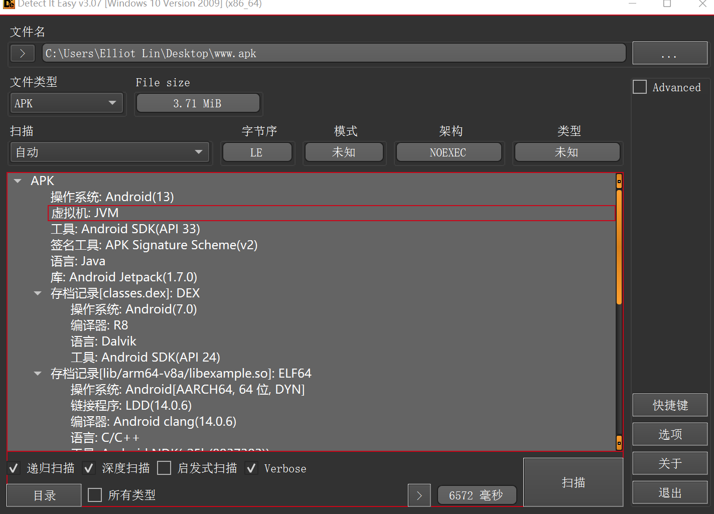

# die扫描，无壳



# GDA 反编译得到代码 
    找到主函数，分析为 求xor


    处理数据，编写python脚本
```python 
Array = [228, 127, 208, 228, 152, ord('Q'), 148, 213, 236, 189, 182, 129, 179, 92, 174, ord('!'), 12, 182, ord('Q'), 1, ord('6'), ord('e'),
         21, ord('q'), 92, 184, 243, 15, ord('J'), 242, 12, 225, 234, ord('|'), 179, 7]

Array1 = [130, 19, 177, 131, 227, ord('3'), 173, 183, 221, 132, 132, 231, 133, ord(':'), 155, 24, ord('9'), 143, ord('a'), ord('7'), 14, ord('S'),
          39, ord('I'), ord('>'), 142, 196, ord('7'), ord('y'), 194, ord('o'), 131, 211, 31, 138, ord('z')]


flag = ""
for i in range(len(Array1)):
    # print(i)
    flag += chr(Array1[i] ^ Array[i])
print(flag)
# flag{b9b192f6f5959068628b67830cb9c9}
```

