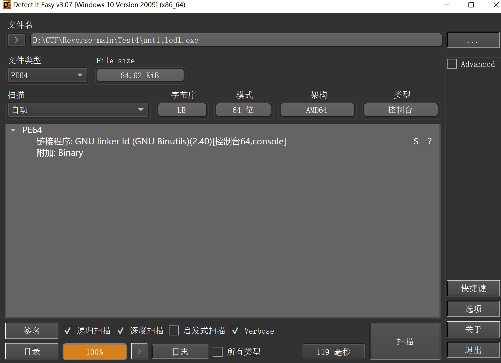
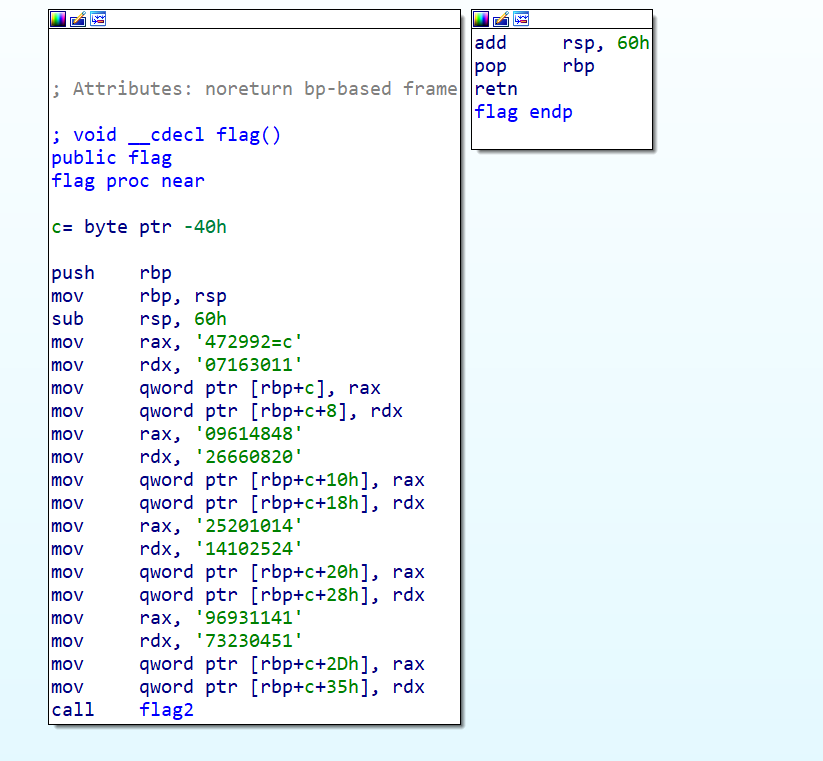
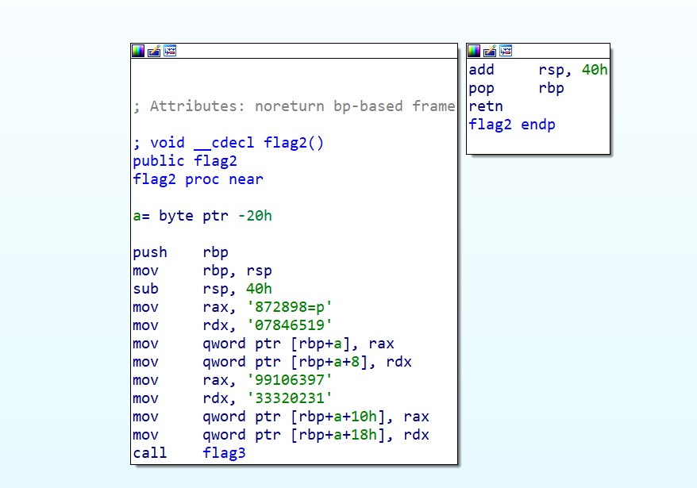
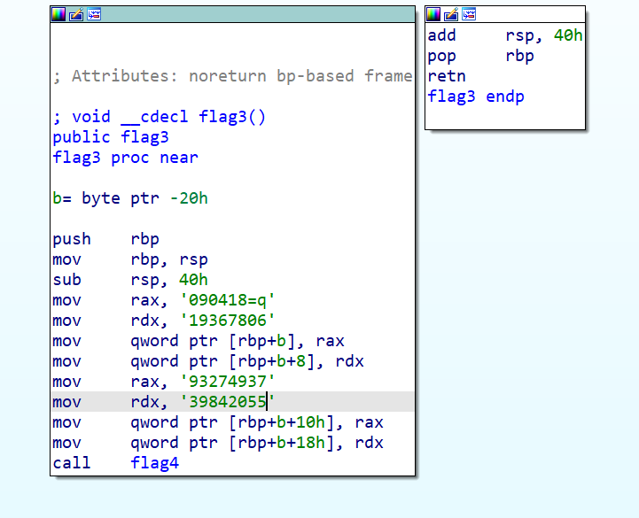
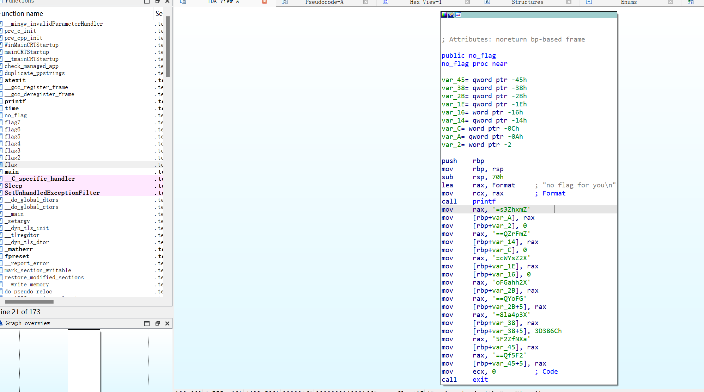

- **查壳，什么都没有，64位**
---


- **IDA64打开**
---




```python
c = [
    '472992=c',
    '07163011',
    '09614848',
    '26660820',
    '25201014',
    '14102524',
    '96931141',
    '73230451'
]

for i in range(0, len(c)):
    c[i] = c[i][::-1]
    print(c[i], end='')
print()

p = [
    '872898=p',
    '07846519',
    '99106397',
    '33320231'
]
for i in range(0, len(p)):
    p[i] = p[i][::-1]
    print(p[i], end='')
print()
q = [
    '090418=q',
    '19367806',
    '93274937',
    '39842055'
]
for i in range(0, len(q)):
    q[i] = q[i][::-1]
    print(q[i], end='')
print()
# 常用值
e = 65537

print('e =', e)
# c = 29927411036170848416900280666241010252425201411411396915403237
# p = 898278915648707936019913202333
# q = 814090608763917394723955024893
# e = 65537
```


```python
from sympy import mod_inverse

c = 29927411036170848416900280666241010252425201411411396915403237
p = 898278915648707936019913202333
q = 814090608763917394723955024893
e = 65537

# 计算 n
n = p * q

# 计算 phi(n)。
phi_n = (p - 1) * (q - 1)

# 计算 d,求e的逆
d = mod_inverse(e, phi_n)

# 解密密文 c
m = pow(c, d, n)
print(m)
# 将解密后的明文转换为字符串
# 假设明文是UTF-8编码的字符串
m_bytes = m.to_bytes((m.bit_length() + 7) // 8, 'big')
print(m_bytes)
m_str = m_bytes.decode('utf-8', errors='ignore')  # 使用errors='ignore'以忽略可能的解码错误

print(m_str)

```
啥也不是
```python
148660743211729002661264059657922794365802421659143955508109
b'\x17\xae\xda\x94;}\xbai\x8d\x82jcr\xd3s\x94\x9bk;\xf9\x8f\xdf+k\x8d'
ڔ;}ijcrsk;+k

```
最后找到的flag(bushi)

```python
import base64

fake = [
    '=s3ZhxmZ',
    '==QZrFmZ',
    '=cWYsZ2X',
    'oFGahh2X',
    '==QYoFG',
    '=8la4p3X',
    '=8l',
    '5F2ZfNXa',
    '==Qf5F2'
]

print(base64.b64decode('ZmxhZ3s=='))
print(base64.b64decode('ZmFrZQ=='))
print(base64.b64decode('X2ZsYWc='))
print(base64.b64decode('X2hhaGFo'))
# print(base64.b64decode('GFoYQ=='))
print(base64.b64decode('X3p4al8='))
# print(base64.b64decode('l8='))
print(base64.b64decode('aXNfZ2F5'))
# print(base64.b64decode('2F5fQ=='))

# b'flag{'
# b'fake'
# b'_flag'
# b'_hahah'
# b'_zxj_'
# b'is_gay'

# flag{fake_flag_hahaha_zxj_is_gay}
```