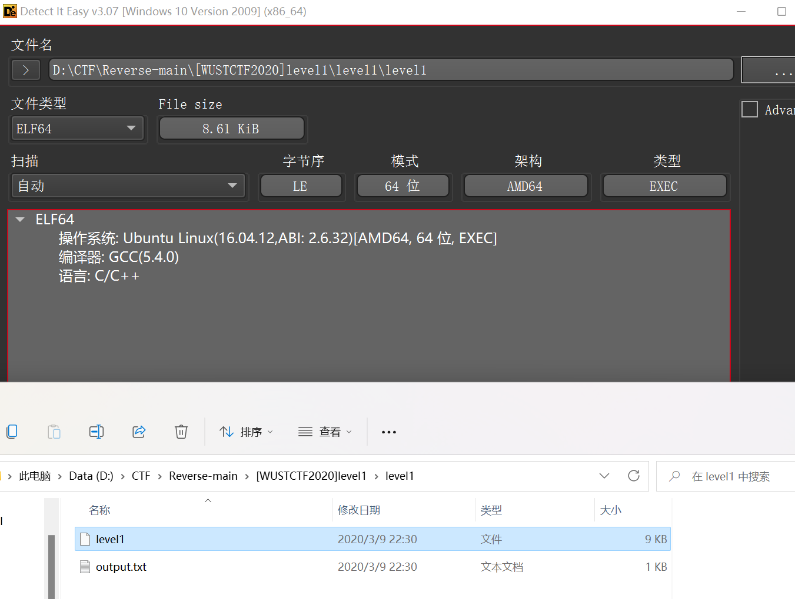
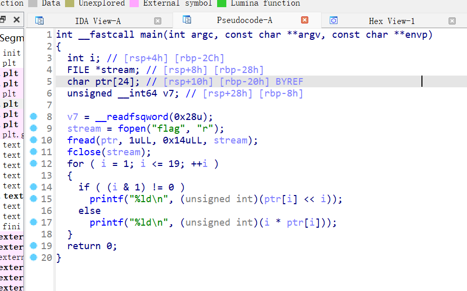

```
output.txt

198
232
816
200
1536
300
6144
984
51200
570
92160
1200
565248
756
1474560
800
6291456
1782
65536000
```
kimi_ai解释 `(i & 1) != 0`
```
i & 1 的含义：

当你将整数 i 与1进行按位与操作时，只有 i 的最低位与1的最低位进行比较。
因为1的二进制表示为 000...0001（只有一个1在最低位），所以 i & 1 的结果只取决于 i 的最低位。
(i & 1) != 0 的含义：

(i & 1) != 0 这个表达式检查 i & 1 的结果是否不等于0。
如果 i 是奇数，i 的最低位是1，所以 i & 1 的结果是1，(i & 1) != 0 为真。
如果 i 是偶数，i 的最低位是0，所以 i & 1 的结果是0，(i & 1) != 0 为假。
```

```
printf("%ld\n", (unsigned int)(ptr[i] << i));：
如果 i 为奇数，将 ptr 数组中索引为 i 的元素左移 i 位，并将结果作为无符号整数打印出来。
```
脚本
```python
c = [
    198,
    232,
    816,
    200,
    1536,
    300,
    6144,
    984,
    51200,
    570,
    92160,
    1200,
    565248,
    756,
    1474560,
    800,
    6291456,
    1782,
    65536000
]
flag = ""
for i in range(1, len(c) + 1):
    if (i & 1) != 0:
        flag += chr(c[i - 1] >> i)
    else:
        flag += chr(c[i - 1] // i)

print(flag)

```
