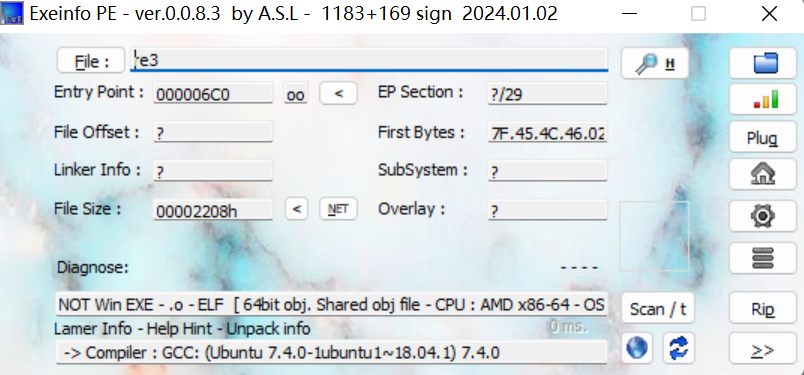

IDA 打开,`F5`得到
```c
int __cdecl main(int argc, const char **argv, const char **envp)
{
  int v4; // [rsp+14h] [rbp-4Ch]
  char *endptr; // [rsp+18h] [rbp-48h] BYREF
  char *v6; // [rsp+20h] [rbp-40h] BYREF
  char *v7; // [rsp+28h] [rbp-38h] BYREF
  char *v8; // [rsp+30h] [rbp-30h] BYREF
  __int64 v9; // [rsp+38h] [rbp-28h]
  __int64 v10; // [rsp+40h] [rbp-20h]
  __int64 v11; // [rsp+48h] [rbp-18h]
  __int64 v12; // [rsp+50h] [rbp-10h]
  unsigned __int64 v13; // [rsp+58h] [rbp-8h]
 
  v13 = __readfsqword(0x28u);
  if ( argc != 5 )
  {
    puts("argc nonono");
    exit(1);
  }
  v4 = strtol(argv[4], &endptr, 16) - 0x6543;
  v9 = f(v4);      
  v10 = strtol(argv[1], &v6, 16);
  v11 = strtol(argv[2], &v7, 16);
  v12 = strtol(argv[3], &v8, 16);
  if ( v9 - v10 != 0x233F0E151CLL )
  {
    puts("argv1 nonono!");
    exit(1);
  }
  if ( v9 - v11 != 0x1B45F81A32LL )
  {
    puts("argv2 nonono!");
    exit(1);
  }
  if ( v9 - v12 != 0x244C071725LL )
  {
    puts("argv3 nonono!");
    exit(1);
  }
  if ( v4 + v12 + v11 + v10 != 0x13A31412F8CLL )
  {
    puts("argv sum nonono!");
    exit(1);
  }
  puts("well done!decode your argv!");
  return 0;
}
```
首先得了解`strtol()`

链接 [strtol语法](https://blog.csdn.net/lizhengze1117/article/details/103318662 "strtol()函数 字符串转换成 十进制 、十六进制 、二进制、 八进制 long类型")。

分析得到 "数学题"

```c
v9 - v10 = 0x233F0E151C
v9 - v11 = 0x1B45F81A32
v9 - v12 = 0x244C071725
v4 + v12 + v11 + v10 = 0x13A31412F8C

==>
v4 + 3 * v9 = 0x233F0E151C + 0x1B45F81A32 + 0x244C071725 + 0x13A31412F8C
```
重点求 `v4` 和 `v9`,点进`v9 = f(v4);`
```c
__int64 __fastcall f(int a1)
{
  int i; // [rsp+1Ch] [rbp-14h]
  __int64 v3; // [rsp+20h] [rbp-10h]
  _QWORD *ptr; // [rsp+28h] [rbp-8h]
 
  if ( a1 <= 1 || a1 > 200 )
    return 0LL;
  ptr = malloc(8LL * a1);
  *ptr = 1LL;
  ptr[1] = 1LL;
  v3 = 0LL;
  for ( i = 2; i < a1; ++i )
  {
    ptr[i] = ptr[i - 1] + ptr[i - 2];       //斐波那契数列
    v3 = ptr[i];
  }
  free(ptr);
  return v3;
}
```
`v4`在 `1~200`,数据较小直接爆破
```python
hex_num = 0x233F0E151C + 0x1B45F81A32 + 0x244C071725 + 0x13A31412F8C
for v4 in range(3, 200):
    fib = [1, 1]
    for i in range(2, v4):
        v9 = fib[i - 1] + fib[i - 2]
        if v4 + 3 * v9 == hex_num:
            print(v4)   # 58
            print(v9)   # 591286729879
        fib.append(v9)
```
最后把`strtol()`逆一下，重新拼接为`flag`
```python
v9 = 591286729879
v4 = 58
# 16进制转字符串
# fromhex() 的类型应为 int ,[2:0]为了去掉 0x
print(bytes.fromhex(hex(v9 - 0x233F0E151C)[2:]))
print(bytes.fromhex(hex(v9 - 0x1B45F81A32)[2:]))
print(bytes.fromhex(hex(v9 - 0x244C071725)[2:]))
print(bytes.fromhex(hex(v4 + 0x6543)[2:]))

# b'flag{'
# b'newbe'
# b'e_her'
# b'e}'
```


 
 
